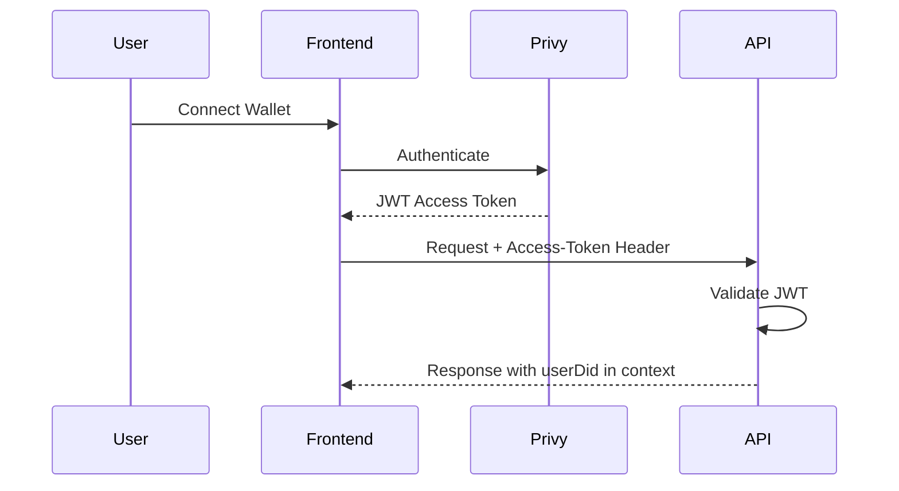

## Overview

The SFLUV API uses **Privy JWT tokens** for authentication. Privy provides wallet-based authentication, and all API requests must include a valid JWT token in the `Access-Token` header.

## Authentication Flow

The authentication process follows these steps:

1. User authenticates with Privy (wallet connection)
2. Frontend obtains JWT access token from Privy
3. Frontend includes token in API requests via `Access-Token` header
4. Backend middleware validates token and extracts user DID
5. Request proceeds with authenticated user context



## Getting a JWT Token

### Frontend Implementation

Using the Privy React SDK:

```typescript
import { usePrivy } from '@privy-io/react-auth'

function MyComponent() {
  const { getAccessToken, authenticated } = usePrivy()
  
  const makeApiCall = async () => {
    if (!authenticated) {
      console.error('User not authenticated')
      return
    }
    
    // Get the access token
    const token = await getAccessToken()
    
    // Make API request
    const response = await fetch('https://api.sfluv.app/users', {
      headers: {
        'Access-Token': token,
        'Content-Type': 'application/json'
      }
    })
    
    const data = await response.json()
    console.log(data)
  }
  
  return (
    <button onClick={makeApiCall}>Get User Data</button>
  )
}
```

### AppProvider Pattern

The SFLUV frontend uses a centralized `authFetch` helper:

```typescript
// From AppProvider.tsx
const authFetch = async (endpoint: string, options: RequestInit = {}): Promise<Response> => {
  const accessToken = await getAccessToken()
  if (!accessToken) throw new Error('no access token')
  
  const headers: HeadersInit = {
    ...options.headers,
    'Access-Token': accessToken,
  }

  return await fetch(BACKEND + endpoint, { ...options, headers })
}

// Usage
const response = await authFetch('/users')
const data = await response.json()
```

## JWT Token Structure

Privy JWT tokens are signed using **ES256** (ECDSA with P-256 and SHA-256) and contain these claims:

### Standard Claims

| Claim | Description | Example |
|-------|-------------|----------|
| `iss` | Issuer - Must be "privy.io" | `"privy.io"` |
| `aud` | Audience - Your Privy App ID | `"clpqr-abc-def-123"` |
| `sub` | Subject - User's DID | `"did:privy:clwxyz123"` |
| `exp` | Expiration timestamp | `1709654400` |
| `iat` | Issued at timestamp | `1709568000` |

### Token Example

```json
{
  "alg": "ES256",
  "typ": "JWT",
  "kid": "privy-key-123"
}
{
  "iss": "privy.io",
  "aud": "clpqr-abc-def-123",
  "sub": "did:privy:clwxyz123",
  "exp": 1709654400,
  "iat": 1709568000
}
```

## Backend Validation

The backend validates JWT tokens using middleware.

### Middleware Flow

From `/backend/utils/middleware/auth.go:14`:

```go
func AuthMiddleware(next http.Handler) http.Handler {
    return http.HandlerFunc(func(w http.ResponseWriter, r *http.Request) {
        // Extract token from Access-Token header
        accessToken := r.Header.Get("Access-Token")
        
        // Parse and validate JWT
        token, err := jwt.ParseWithClaims(accessToken, &jwt.MapClaims{}, keyFunc)
        if err != nil {
            next.ServeHTTP(w, r)
            return
        }
        
        // Validate claims
        err = Valid(token.Claims)
        if err != nil {
            next.ServeHTTP(w, r)
            return
        }
        
        // Extract user DID from subject claim
        userDid, err := token.Claims.GetSubject()
        if err != nil {
            next.ServeHTTP(w, r)
            return
        }
        
        // Inject userDid into request context
        ctx := context.WithValue(r.Context(), "userDid", userDid)
        r = r.WithContext(ctx)
        
        next.ServeHTTP(w, r)
    })
}
```

### Validation Steps

From `/backend/utils/middleware/auth.go:43`:

```go
func Valid(c jwt.Claims) error {
    appId := os.Getenv("PRIVY_APP_ID")
    
    // 1. Validate audience matches your Privy App ID
    aud, err := c.GetAudience()
    if err != nil {
        return err
    }
    if aud[0] != appId {
        return errors.New("aud claim must be your Privy App ID")
    }
    
    // 2. Validate issuer is privy.io
    iss, err := c.GetIssuer()
    if err != nil {
        return err
    }
    if iss != "privy.io" {
        return errors.New("iss claim must be 'privy.io'")
    }
    
    // 3. Validate token hasn't expired
    exp, err := c.GetExpirationTime()
    if err != nil {
        return err
    }
    if exp.Before(time.Now()) {
        return errors.New("token is expired")
    }
    
    return nil
}
```

### Signature Verification

From `/backend/utils/middleware/auth.go:73`:

```go
func keyFunc(token *jwt.Token) (interface{}, error) {
    verificationKey := os.Getenv("PRIVY_VKEY")
    
    // Ensure ES256 algorithm
    if token.Method.Alg() != "ES256" {
        return nil, fmt.Errorf("unexpected JWT signing method=%v", token.Header["alg"])
    }
    
    // Parse EC public key from PEM
    return jwt.ParseECPublicKeyFromPEM([]byte(verificationKey))
}
```

## Making Authenticated Requests

### Basic GET Request

```bash
curl -X GET https://api.sfluv.app/users \
  -H "Access-Token: eyJhbGciOiJFUzI1NiIsInR5cCI6IkpXVCIsImtpZCI6IjEyMyJ9.eyJpc3MiOiJwcml2eS5pbyIsImF1ZCI6ImNscHFyLWFiYy1kZWYtMTIzIiwic3ViIjoiZGlkOnByaXZ5OmNsd3h5ejEyMyIsImV4cCI6MTcwOTY1NDQwMCwiaWF0IjoxNzA5NTY4MDAwfQ.abcd1234..." \
  -H "Content-Type: application/json"
```

### POST Request with Body

```bash
curl -X POST https://api.sfluv.app/locations \
  -H "Access-Token: eyJhbGciOiJFUzI1NiIsInR5cCI6IkpXVCJ9..." \
  -H "Content-Type: application/json" \
  -d '{
    "name": "Coffee Shop",
    "address": "123 Main St",
    "latitude": 37.7749,
    "longitude": -122.4194
  }'
```

### Role-Protected Endpoint

```bash
# Requires admin role
curl -X GET https://api.sfluv.app/admin/users \
  -H "Access-Token: eyJhbGciOiJFUzI1NiIsInR5cCI6IkpXVCJ9..." \
  -H "Content-Type: application/json"

# Alternative: Use admin key (bypasses JWT)
curl -X GET https://api.sfluv.app/admin/users \
  -H "X-Admin-Key: your-admin-key" \
  -H "Content-Type: application/json"
```

## Admin Authentication

Admin endpoints support two authentication methods:

### 1. JWT with Admin Role

Standard JWT authentication where the user has `is_admin = true`.

### 2. Admin Key Header

For scripted/automated access, use the `X-Admin-Key` header:

```bash
curl -X GET https://api.sfluv.app/events \
  -H "X-Admin-Key: your-secret-admin-key" \
  -H "Content-Type: application/json"
```

From `/backend/router/router.go:218`:

```go
func withAdmin(handlerFunc http.HandlerFunc, s *handlers.AppService) http.HandlerFunc {
    return func(w http.ResponseWriter, r *http.Request) {
        // Check for admin key first
        reqKey := r.Header.Get("X-Admin-Key")
        envKey := os.Getenv("ADMIN_KEY")
        if reqKey == envKey && envKey != "" {
            // Admin key is valid
            if _, ok := r.Context().Value("userDid").(string); !ok {
                // Inject first admin ID into context
                adminId := s.GetFirstAdminId(r.Context())
                if adminId != "" {
                    ctx := context.WithValue(r.Context(), "userDid", adminId)
                    r = r.WithContext(ctx)
                }
            }
            handlerFunc(w, r)
            return
        }
        
        // Fall back to JWT validation
        id, ok := r.Context().Value("userDid").(string)
        if !ok {
            w.WriteHeader(http.StatusForbidden)
            return
        }
        
        isAdmin := s.IsAdmin(r.Context(), id)
        if !isAdmin {
            w.WriteHeader(http.StatusForbidden)
            return
        }
        
        handlerFunc(w, r)
    }
}
```

## User Context

After successful authentication, the middleware injects `userDid` into the request context. This is available to all handlers:

```go
// Extract authenticated user DID
userDid, ok := r.Context().Value("userDid").(string)
if !ok {
    w.WriteHeader(http.StatusForbidden)
    return
}

// Use userDid for queries
user, err := service.GetUserByDID(ctx, userDid)
```

## Authentication Errors

### Missing Token

```bash
curl -X GET https://api.sfluv.app/users

# Response
HTTP/1.1 403 Forbidden
```

### Invalid Token

```bash
curl -X GET https://api.sfluv.app/users \
  -H "Access-Token: invalid.token.here"

# Response
HTTP/1.1 403 Forbidden
```

### Expired Token

```bash
curl -X GET https://api.sfluv.app/users \
  -H "Access-Token: eyJhbGciOiJFUzI1NiIsInR5cCI6IkpXVCJ9..."

# Response (if exp claim is past)
HTTP/1.1 403 Forbidden
```

### Insufficient Permissions

```bash
# Non-admin user trying to access admin endpoint
curl -X GET https://api.sfluv.app/admin/users \
  -H "Access-Token: eyJhbGciOiJFUzI1NiIsInR5cCI6IkpXVCJ9..."

# Response
HTTP/1.1 403 Forbidden
```

## Environment Configuration

Required environment variables for authentication:

```bash
# Backend .env
PRIVY_APP_ID=clpqr-abc-def-123
PRIVY_VKEY="-----BEGIN PUBLIC KEY-----\nMFkwEwYHKoZIzj0CAQYIKoZIzj0DAQcDQgAE...\n-----END PUBLIC KEY-----"
ADMIN_KEY=your-secret-admin-key
```

```bash
# Frontend .env  
NEXT_PUBLIC_PRIVY_APP_ID=clpqr-abc-def-123
NEXT_PUBLIC_BACKEND_URL=https://api.sfluv.app
```

## Security Best Practices

<AccordionGroup>
  <Accordion title="Token Storage">
    - Never store JWT tokens in localStorage (XSS vulnerable)
    - Privy SDK handles token storage securely
    - Tokens are short-lived and automatically refreshed
  </Accordion>
  
  <Accordion title="Token Transmission">
    - Always use HTTPS in production
    - Include tokens only in headers, never in URLs
    - Use the `Access-Token` header, not `Authorization`
  </Accordion>
  
  <Accordion title="Admin Keys">
    - Store `ADMIN_KEY` securely (never in frontend)
    - Rotate admin keys periodically
    - Use admin keys only for automated scripts
  </Accordion>
  
  <Accordion title="Token Validation">
    - Backend validates issuer (`iss`), audience (`aud`), and expiration (`exp`)
    - Signature verified using Privy's public key
    - Algorithm restricted to ES256 only
  </Accordion>
</AccordionGroup>

## Testing Authentication

To test authentication locally:

1. **Start the backend:**
   ```bash
   cd backend
   go run .
   ```

2. **Run the frontend:**
   ```bash
   cd frontend
   npm run dev
   ```

3. **Connect wallet and get token:**
   ```typescript
   const token = await getAccessToken()
   console.log(token)
   ```

4. **Test API call:**
   ```bash
   curl -X GET http://localhost:8080/users \
     -H "Access-Token: <your-token>"
   ```

## Next Steps

<CardGroup cols={2}>
  <Card title="API Overview" icon="globe" href="/api/overview">
    Learn about base URLs, response formats, and errors
  </Card>
  <Card title="User Endpoints" icon="user" href="/api-reference/introduction">
    Explore user management endpoints
  </Card>
</CardGroup>
