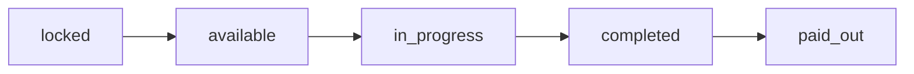

## Overview

Workflow steps are sequential tasks within a workflow that improvers claim and complete. Each step has a specific role requirement, bounty, and work items that must be submitted.

### Step Lifecycle



- **locked** - Previous step not yet completed
- **available** - Ready to be claimed by qualified improver
- **in_progress** - Claimed and started by an improver
- **completed** - Submitted and validated
- **paid_out** - Improver payment processed

---

## Claim Workflow Step

<RequestExample>
```bash cURL
curl -X POST https://api.sfluv.com/improvers/workflows/workflow_abc123/steps/step_ghi789/claim \
  -H "Authorization: Bearer YOUR_TOKEN"
```
</RequestExample>

<ResponseExample>
```json 200 OK
{
  "id": "workflow_abc123",
  "title": "Weekly Park Cleanup",
  "status": "in_progress",
  "steps": [
    {
      "id": "step_ghi789",
      "workflow_id": "workflow_abc123",
      "step_order": 1,
      "title": "Litter Collection",
      "bounty": 100000000000000000000,
      "role_id": "role_def456",
      "assigned_improver_id": "did:privy:improver789",
      "assigned_improver_name": "Jane Smith",
      "status": "available",
      "work_items": [...]
    }
  ]
}
```
</ResponseExample>

**Endpoint:** `POST /improvers/workflows/{workflow_id}/steps/{step_id}/claim`

**Auth:** Improver role required

**Path Parameters:**

<ParamField path="workflow_id" type="string" required>
  Workflow UUID
</ParamField>

<ParamField path="step_id" type="string" required>
  Step UUID
</ParamField>

**Description:** 
- Assigns the step to the authenticated improver
- Validates improver has required credentials
- Checks for absence periods (recurring workflows)
- Unlocks next sequential step if this is part of a chain

**Response Codes:**
- `200` - Step claimed successfully
- `400` - Step not claimable (locked, missing role, etc.)
- `403` - Missing required credentials
- `404` - Workflow or step not found
- `409` - Already assigned, already claimed, or absence period conflict
- `500` - Server error

---

## Start Workflow Step

<RequestExample>
```bash cURL
curl -X POST https://api.sfluv.com/improvers/workflows/workflow_abc123/steps/step_ghi789/start \
  -H "Authorization: Bearer YOUR_TOKEN"
```
</RequestExample>

<ResponseExample>
```json 200 OK
{
  "id": "workflow_abc123",
  "status": "in_progress",
  "steps": [
    {
      "id": "step_ghi789",
      "status": "in_progress",
      "assigned_improver_id": "did:privy:improver789",
      "started_at": 1710500000,
      "work_items": [...]
    }
  ]
}
```
</ResponseExample>

**Endpoint:** `POST /improvers/workflows/{workflow_id}/steps/{step_id}/start`

**Auth:** Improver role required (must be assigned to step)

**Path Parameters:**

<ParamField path="workflow_id" type="string" required>
  Workflow UUID
</ParamField>

<ParamField path="step_id" type="string" required>
  Step UUID
</ParamField>

**Description:** Marks the step as actively in progress. Sets `started_at` timestamp.

**Response Codes:**
- `200` - Step started successfully
- `403` - Step not assigned to caller
- `404` - Workflow or step not found
- `409` - Step not available yet, not active, or already completed
- `500` - Server error

---

## Complete Workflow Step

<RequestExample>
```bash cURL
curl -X POST https://api.sfluv.com/improvers/workflows/workflow_abc123/steps/step_ghi789/complete \
  -H "Authorization: Bearer YOUR_TOKEN" \
  -H "Content-Type: application/json" \
  -d '{
    "step_not_possible": false,
    "items": [
      {
        "item_id": "item_jkl012",
        "photo_uploads": [
          {
            "file_name": "before.jpg",
            "content_type": "image/jpeg",
            "data_base64": "iVBORw0KGgoAAAANSUhEUgAAAAEAAAABCAYAAAAfFcSJAAAADUlEQVR42mNk..."
          }
        ],
        "written_response": "Area thoroughly cleaned",
        "dropdown_value": "completed_successfully"
      }
    ]
  }'
```
</RequestExample>

<ResponseExample>
```json 200 OK
{
  "id": "workflow_abc123",
  "status": "in_progress",
  "steps": [
    {
      "id": "step_ghi789",
      "status": "completed",
      "assigned_improver_id": "did:privy:improver789",
      "started_at": 1710500000,
      "completed_at": 1710501500,
      "submission": {
        "id": "submission_mno345",
        "workflow_id": "workflow_abc123",
        "step_id": "step_ghi789",
        "improver_id": "did:privy:improver789",
        "step_not_possible": false,
        "item_responses": [
          {
            "item_id": "item_jkl012",
            "photo_ids": ["photo_pqr678"],
            "written_response": "Area thoroughly cleaned",
            "dropdown_value": "completed_successfully"
          }
        ],
        "submitted_at": 1710501500,
        "updated_at": 1710501500
      }
    },
    {
      "id": "step_xyz999",
      "step_order": 2,
      "status": "available",
      "role_id": "role_def456"
    }
  ]
}
```
</ResponseExample>

**Endpoint:** `POST /improvers/workflows/{workflow_id}/steps/{step_id}/complete`

**Auth:** Improver role required (must be assigned to step)

**Path Parameters:**

<ParamField path="workflow_id" type="string" required>
  Workflow UUID
</ParamField>

<ParamField path="step_id" type="string" required>
  Step UUID
</ParamField>

**Request Body:**

<ParamField body="step_not_possible" type="boolean">
  If true, marks step as failed/impossible (must be allowed in step config)
</ParamField>

<ParamField body="step_not_possible_details" type="string">
  Required explanation if `step_not_possible` is true
</ParamField>

<ParamField body="items" type="array" required>
  Array of work item responses:
  - `item_id` (string, required): Work item UUID
  - `photo_uploads` (array): Photos encoded as base64
    - `file_name` (string): Original filename
    - `content_type` (string): MIME type
    - `data_base64` (string): Base64-encoded image data
  - `photo_ids` (string[]): Previously uploaded photo IDs
  - `written_response` (string): Text response
  - `dropdown_value` (string): Selected dropdown option value
</ParamField>

**Response Behavior:**
- Validates all required work items are completed
- Unlocks next sequential step (status changes to `available`)
- Triggers email notifications for dropdown options with notify emails
- Processes payout if workflow is completed
- Returns updated workflow with all steps

**Response Codes:**
- `200` - Step completed successfully
- `400` - Missing required items, invalid data, or validation errors
- `403` - Step not assigned to caller
- `404` - Workflow or step not found
- `500` - Server error

---

## Request Step Payout Retry

<RequestExample>
```bash cURL
curl -X POST https://api.sfluv.com/improvers/workflows/workflow_abc123/steps/step_ghi789/payout-request \
  -H "Authorization: Bearer YOUR_TOKEN"
```
</RequestExample>

<ResponseExample>
```json 200 OK
{
  "id": "workflow_abc123",
  "steps": [
    {
      "id": "step_ghi789",
      "status": "completed",
      "payout_error": "insufficient balance in faucet",
      "payout_last_try_at": 1710501500,
      "retry_requested_at": 1710505000,
      "retry_requested_by": "did:privy:improver789"
    }
  ]
}
```
</ResponseExample>

**Endpoint:** `POST /improvers/workflows/{workflow_id}/steps/{step_id}/payout-request`

**Auth:** Improver role required (must be assigned to step)

**Path Parameters:**

<ParamField path="workflow_id" type="string" required>
  Workflow UUID
</ParamField>

<ParamField path="step_id" type="string" required>
  Step UUID
</ParamField>

**Description:** Requests a retry for a failed payout. Used when step is completed but payment failed due to insufficient faucet balance or other errors.

**Response Codes:**
- `200` - Retry requested, payout processing attempted
- `409` - No failed payout found for this step
- `500` - Server error

---

## Unclaim Workflow Series

<RequestExample>
```bash cURL
curl -X POST https://api.sfluv.com/improvers/workflow-series/unclaim \
  -H "Authorization: Bearer YOUR_TOKEN" \
  -H "Content-Type: application/json" \
  -d '{
    "series_id": "series_xyz789",
    "step_order": 1
  }'
```
</RequestExample>

<ResponseExample>
```json 200 OK
{
  "series_id": "series_xyz789",
  "step_order": 1,
  "released_count": 3,
  "skipped_count": 1
}
```
</ResponseExample>

**Endpoint:** `POST /improvers/workflow-series/unclaim`

**Auth:** Improver role required

**Request Body:**

<ParamField body="series_id" type="string" required>
  Workflow series UUID
</ParamField>

<ParamField body="step_order" type="integer" required>
  Step position in workflow (1-indexed)
</ParamField>

**Description:** Releases all claimed instances of a recurring workflow step in a series. Only affects future workflows (status `available` or `locked`), not in-progress or completed steps.

**Response:**
- `released_count`: Number of step assignments removed
- `skipped_count`: Number of steps that couldn't be released (already started/completed)

**Response Codes:**
- `200` - Unclaim successful
- `400` - Invalid series ID or step order
- `409` - No claimed recurring workpiece found
- `500` - Server error

---

## Schema Reference

### WorkflowStep Object

```typescript
interface WorkflowStep {
  id: string
  workflow_id: string
  step_order: number  // 1-indexed position
  title: string
  description: string
  bounty: number  // wei (uint64)
  allow_step_not_possible: boolean
  role_id?: string | null
  assigned_improver_id?: string | null
  assigned_improver_name?: string | null
  status: "locked" | "available" | "in_progress" | "completed" | "paid_out"
  started_at?: number | null
  completed_at?: number | null
  payout_error?: string | null
  payout_last_try_at?: number | null
  retry_requested_at?: number | null
  retry_requested_by?: string | null
  submission?: WorkflowStepSubmission | null
  work_items: WorkflowWorkItem[]
}
```

### WorkflowStepSubmission Object

```typescript
interface WorkflowStepSubmission {
  id: string
  workflow_id: string
  step_id: string
  improver_id: string
  step_not_possible: boolean
  step_not_possible_details?: string | null
  item_responses: WorkflowStepItemResponse[]
  submitted_at: number  // Unix timestamp
  updated_at: number
}
```

### WorkflowStepItemResponse Object

```typescript
interface WorkflowStepItemResponse {
  item_id: string
  photo_urls?: string[]  // legacy
  photo_ids?: string[]
  photo_uploads?: WorkflowPhotoUpload[]
  photos?: WorkflowSubmissionPhoto[]
  written_response?: string
  dropdown_value?: string
}
```

### WorkflowWorkItem Object

```typescript
interface WorkflowWorkItem {
  id: string
  step_id: string
  item_order: number
  title: string
  description: string
  optional: boolean
  requires_photo: boolean
  camera_capture_only: boolean
  photo_required_count: number
  photo_allow_any_count: boolean
  photo_aspect_ratio: "vertical" | "square" | "horizontal"
  requires_written_response: boolean
  requires_dropdown: boolean
  dropdown_options: WorkflowDropdownOption[]
  dropdown_requires_written_response: Record<string, boolean>
}
```

### WorkflowDropdownOption Object

```typescript
interface WorkflowDropdownOption {
  value: string  // unique identifier
  label: string  // display text
  requires_written_response: boolean
  notify_emails?: string[]  // emails to notify when selected (redacted for non-managers)
  notify_email_count?: number  // count visible to all users
}
```

### WorkflowPhotoUpload Object

```typescript
interface WorkflowPhotoUpload {
  file_name: string
  content_type: string  // e.g. "image/jpeg"
  data_base64: string  // base64-encoded image data
}
```

### WorkflowSubmissionPhoto Object

```typescript
interface WorkflowSubmissionPhoto {
  id: string
  workflow_id: string
  step_id: string
  item_id: string
  submission_id: string
  file_name: string
  content_type: string
  size_bytes: number
  created_at: number
}
```

---

## Related Endpoints

- [Workflows](/api/workflows) - Create and manage workflows
- [Improvers API](/api/improvers) - View available opportunities
- [Workflows API](/api/workflows) - Retrieve workflow details
