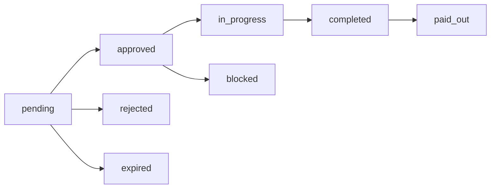

## Overview

Workflows are the core tasks in SFLUV that proposers create and voters approve. Each workflow consists of multiple steps assigned to different improver roles and can be one-time or recurring (daily, weekly, monthly).

### Workflow Lifecycle



- **pending** - Under voter review (14 day expiry)
- **approved** - Approved by voters, awaiting start
- **rejected** - Denied by voters
- **expired** - Pending over 14 days without decision
- **in_progress** - Started, steps being completed
- **completed** - All steps finished
- **paid_out** - All improvers and supervisor paid
- **blocked** - Recurring series awaiting prior workflow payout
- **deleted** - Removed via deletion proposal

---

## Create Workflow

<RequestExample>
```bash cURL
curl -X POST https://api.sfluv.com/proposers/workflows \
  -H "Authorization: Bearer YOUR_TOKEN" \
  -H "Content-Type: application/json" \
  -d '{
    "title": "Weekly Park Cleanup",
    "description": "Remove litter and maintain park grounds",
    "recurrence": "weekly",
    "start_at": "2024-03-15T10:00:00Z",
    "supervisor": {
      "user_id": "did:privy:supervisor123",
      "bounty": 50000000000000000000
    },
    "roles": [
      {
        "client_id": "role-1",
        "title": "Park Cleaner",
        "required_credentials": ["dpw_certified"]
      }
    ],
    "steps": [
      {
        "title": "Litter Collection",
        "description": "Collect all visible litter",
        "bounty": 100000000000000000000,
        "role_client_id": "role-1",
        "allow_step_not_possible": false,
        "work_items": [
          {
            "title": "Before Photo",
            "description": "Take photo of area before cleanup",
            "optional": false,
            "requires_photo": true,
            "camera_capture_only": true,
            "photo_required_count": 1,
            "photo_allow_any_count": false,
            "photo_aspect_ratio": "square",
            "requires_written_response": false,
            "requires_dropdown": false,
            "dropdown_options": []
          }
        ]
      }
    ]
  }'
```
</RequestExample>

<ResponseExample>
```json 201 Created
{
  "id": "workflow_abc123",
  "series_id": "series_xyz789",
  "proposer_id": "did:privy:proposer456",
  "title": "Weekly Park Cleanup",
  "description": "Remove litter and maintain park grounds",
  "recurrence": "weekly",
  "start_at": 1710496800,
  "status": "pending",
  "is_start_blocked": false,
  "total_bounty": 150000000000000000000,
  "weekly_bounty_requirement": 150000000000000000000,
  "budget_weekly_deducted": 0,
  "budget_one_time_deducted": 0,
  "supervisor_required": true,
  "supervisor_user_id": "did:privy:supervisor123",
  "supervisor_bounty": 50000000000000000000,
  "supervisor_title": "DPW Supervisor",
  "supervisor_organization": "Department of Public Works",
  "created_at": 1710410400,
  "updated_at": 1710410400,
  "roles": [
    {
      "id": "role_def456",
      "workflow_id": "workflow_abc123",
      "title": "Park Cleaner",
      "required_credentials": ["dpw_certified"]
    }
  ],
  "steps": [
    {
      "id": "step_ghi789",
      "workflow_id": "workflow_abc123",
      "step_order": 1,
      "title": "Litter Collection",
      "description": "Collect all visible litter",
      "bounty": 100000000000000000000,
      "allow_step_not_possible": false,
      "role_id": "role_def456",
      "status": "locked",
      "work_items": [
        {
          "id": "item_jkl012",
          "step_id": "step_ghi789",
          "item_order": 1,
          "title": "Before Photo",
          "description": "Take photo of area before cleanup",
          "optional": false,
          "requires_photo": true,
          "camera_capture_only": true,
          "photo_required_count": 1,
          "photo_allow_any_count": false,
          "photo_aspect_ratio": "square",
          "requires_written_response": false,
          "requires_dropdown": false,
          "dropdown_options": [],
          "dropdown_requires_written_response": {}
        }
      ]
    }
  ],
  "votes": {
    "approve": 0,
    "deny": 0,
    "votes_cast": 0,
    "total_voters": 10,
    "quorum_reached": false,
    "quorum_threshold": 5
  }
}
```
</ResponseExample>

**Endpoint:** `POST /proposers/workflows`

**Auth:** Proposer role required

**Request Body:**

<ParamField body="title" type="string" required>
  Workflow title (must not be empty)
</ParamField>

<ParamField body="description" type="string" required>
  Detailed workflow description
</ParamField>

<ParamField body="recurrence" type="string" required>
  Frequency: `one_time`, `daily`, `weekly`, or `monthly`
</ParamField>

<ParamField body="start_at" type="string" required>
  ISO 8601 datetime when workflow begins
</ParamField>

<ParamField body="series_id" type="string">
  Link to existing recurring workflow series (optional)
</ParamField>

<ParamField body="supervisor" type="object">
  Optional supervisor configuration
  - `user_id` (string, required): Supervisor DID
  - `bounty` (uint64, required): Supervisor payment in wei
</ParamField>

<ParamField body="roles" type="array" required>
  Array of workflow roles:
  - `client_id` (string): Temporary ID for step assignment
  - `title` (string): Role name
  - `required_credentials` (string[]): Credential types needed
</ParamField>

<ParamField body="steps" type="array" required>
  Sequential workflow steps (see [Workflow Steps](/api/workflow-steps))
</ParamField>

**Response Codes:**
- `201` - Workflow created successfully
- `400` - Invalid request (missing fields, invalid recurrence, etc.)
- `403` - User not approved as proposer
- `500` - Server error

---

## Get Workflow by ID

<RequestExample>
```bash cURL
curl https://api.sfluv.com/workflows/workflow_abc123 \
  -H "Authorization: Bearer YOUR_TOKEN"
```
</RequestExample>

<ResponseExample>
```json 200 OK
{
  "id": "workflow_abc123",
  "series_id": "series_xyz789",
  "proposer_id": "did:privy:proposer456",
  "title": "Weekly Park Cleanup",
  "status": "approved",
  "total_bounty": 150000000000000000000,
  "votes": {
    "approve": 7,
    "deny": 1,
    "votes_cast": 8,
    "total_voters": 10,
    "quorum_reached": true,
    "quorum_threshold": 5,
    "quorum_reached_at": 1710425000,
    "finalize_at": 1710511400,
    "decision": "approve",
    "my_decision": "approve"
  },
  "roles": [...],
  "steps": [...]
}
```
</ResponseExample>

**Endpoint:** `GET /workflows/{workflow_id}`

**Auth:** Authenticated user required

**Path Parameters:**

<ParamField path="workflow_id" type="string" required>
  Workflow UUID
</ParamField>

**Response Codes:**
- `200` - Success
- `404` - Workflow not found
- `403` - Not authenticated
- `500` - Server error

---

## Get Proposer Workflows

<RequestExample>
```bash cURL
curl https://api.sfluv.com/proposers/workflows \
  -H "Authorization: Bearer YOUR_TOKEN"
```
</RequestExample>

<ResponseExample>
```json 200 OK
[
  {
    "id": "workflow_abc123",
    "series_id": "series_xyz789",
    "title": "Weekly Park Cleanup",
    "status": "approved",
    "start_at": 1710496800,
    "total_bounty": 150000000000000000000,
    "steps": [...]
  },
  {
    "id": "workflow_def456",
    "series_id": "series_xyz789",
    "title": "Weekly Park Cleanup",
    "status": "completed",
    "start_at": 1710101400,
    "total_bounty": 150000000000000000000,
    "steps": [...]
  }
]
```
</ResponseExample>

**Endpoint:** `GET /proposers/workflows`

**Auth:** Proposer role required

**Description:** Returns all workflows created by the authenticated proposer, including all statuses (pending, approved, rejected, completed, etc.)

---

## Get Single Proposer Workflow

<RequestExample>
```bash cURL
curl https://api.sfluv.com/proposers/workflows/workflow_abc123 \
  -H "Authorization: Bearer YOUR_TOKEN"
```
</RequestExample>

**Endpoint:** `GET /proposers/workflows/{workflow_id}`

**Auth:** Proposer role required (must be workflow creator)

**Path Parameters:**

<ParamField path="workflow_id" type="string" required>
  Workflow UUID
</ParamField>

**Response Codes:**
- `200` - Success
- `404` - Workflow not found or not owned by proposer
- `403` - Not authenticated or not proposer
- `500` - Server error

---

## Delete Workflow

<RequestExample>
```bash cURL
curl -X DELETE https://api.sfluv.com/proposers/workflows/workflow_abc123 \
  -H "Authorization: Bearer YOUR_TOKEN"
```
</RequestExample>

<ResponseExample>
```json 200 OK
{}
```
</ResponseExample>

**Endpoint:** `DELETE /proposers/workflows/{workflow_id}`

**Auth:** Proposer role required (must be workflow creator)

**Path Parameters:**

<ParamField path="workflow_id" type="string" required>
  Workflow UUID
</ParamField>

**Description:** Only pending workflows can be directly deleted. Approved or in-progress workflows require a deletion proposal vote.

**Response Codes:**
- `200` - Workflow deleted successfully
- `400` - Workflow cannot be deleted (already approved/in progress)
- `404` - Workflow not found or not owned by proposer
- `403` - Not authenticated or not proposer
- `500` - Server error

---

## Get Active Workflows

<RequestExample>
```bash cURL
curl https://api.sfluv.com/workflows/active \
  -H "Authorization: Bearer YOUR_TOKEN"
```
</RequestExample>

<ResponseExample>
```json 200 OK
[
  {
    "id": "workflow_abc123",
    "series_id": "series_xyz789",
    "proposer_id": "did:privy:proposer456",
    "title": "Weekly Park Cleanup",
    "description": "Remove litter and maintain park grounds",
    "recurrence": "weekly",
    "start_at": 1710496800,
    "status": "in_progress",
    "is_start_blocked": false,
    "total_bounty": 150000000000000000000,
    "weekly_bounty_requirement": 150000000000000000000,
    "created_at": 1710410400,
    "updated_at": 1710496800,
    "vote_decision": "approve",
    "approved_at": 1710425000
  }
]
```
</ResponseExample>

**Endpoint:** `GET /workflows/active`

**Auth:** Authenticated user with proposer, improver, voter, or supervisor role

**Description:** Returns workflows with status `approved`, `blocked`, `in_progress`, or `completed` (not yet paid out).

**Response:** Array of `ActiveWorkflowListItem` objects (simplified workflow representation without steps/roles)

---

## Schema Reference

### Workflow Object

```typescript
interface Workflow {
  id: string
  series_id: string
  proposer_id: string
  title: string
  description: string
  recurrence: "one_time" | "daily" | "weekly" | "monthly"
  start_at: number  // Unix timestamp
  status: "pending" | "approved" | "rejected" | "in_progress" | 
          "completed" | "paid_out" | "blocked" | "expired" | "deleted"
  is_start_blocked: boolean
  blocked_by_workflow_id?: string | null
  total_bounty: number  // wei (uint64)
  weekly_bounty_requirement: number  // wei
  budget_weekly_deducted: number  // wei
  budget_one_time_deducted: number  // wei
  vote_quorum_reached_at?: number | null
  vote_finalize_at?: number | null
  vote_finalized_at?: number | null
  vote_finalized_by_user_id?: string | null
  vote_decision?: "approve" | "deny" | "admin_approve" | null
  supervisor_required: boolean
  supervisor_user_id?: string | null
  supervisor_bounty: number  // wei
  supervisor_paid_out_at?: number | null
  supervisor_payout_error?: string | null
  supervisor_payout_last_try_at?: number | null
  supervisor_retry_requested_at?: number | null
  supervisor_retry_requested_by?: string | null
  supervisor_title?: string | null
  supervisor_organization?: string | null
  created_at: number
  updated_at: number
  roles: WorkflowRole[]
  steps: WorkflowStep[]
  votes: WorkflowVotes
}
```

### WorkflowRole Object

```typescript
interface WorkflowRole {
  id: string
  workflow_id: string
  title: string
  required_credentials: string[]  // credential types
}
```

### WorkflowVotes Object

```typescript
interface WorkflowVotes {
  approve: number
  deny: number
  votes_cast: number
  total_voters: number
  quorum_reached: boolean
  quorum_threshold: number  // 50% of total voters
  quorum_reached_at?: number | null
  finalize_at?: number | null  // quorum_reached_at + 24 hours
  finalized_at?: number | null
  decision?: "approve" | "deny" | "admin_approve" | null
  my_decision?: "approve" | "deny" | null  // current user's vote
}
```

### Bounty Values

All bounty amounts are in **wei** (1 ETH = 10^18 wei). Example:
- 50 HONEY = `50000000000000000000` wei
- 0.5 HONEY = `500000000000000000` wei

---

## Related Endpoints

- [Workflow Steps](/api/workflow-steps) - Claim, start, complete workflow steps
- [Workflow Templates](/api/workflow-templates) - Reusable workflow definitions
- [Workflow Votes](/api/workflow-votes) - Vote on workflow proposals
