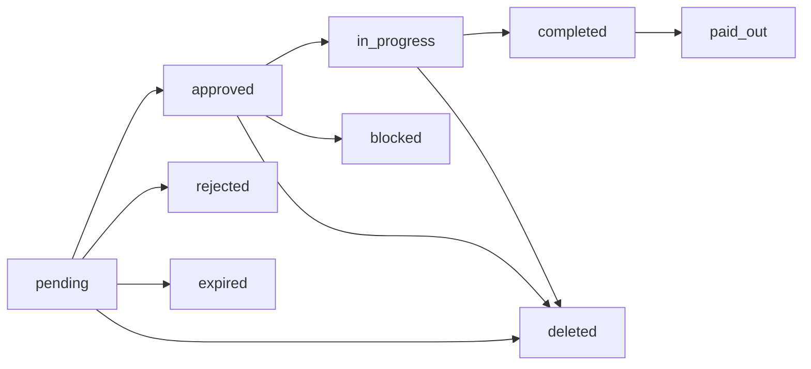
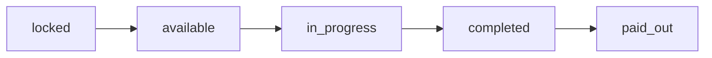

## Architecture Overview

SFLUV is built as a modern web application with blockchain integration, consisting of three main services and three PostgreSQL databases.

<Note>
This architecture ensures security, scalability, and transparency while maintaining blockchain integration for all currency transactions.
</Note>

## System Components

### Frontend Application

The user-facing web application built with modern React technologies.

**Technology Stack:**
- **Next.js 15** - React framework with App Router
- **React 19** - Latest React with concurrent features
- **Tailwind CSS** - Utility-first styling
- **Radix UI** - Accessible component primitives
- **Privy** - Wallet authentication and management
- **Permissionless SDK** - Account abstraction and smart accounts
- **ethers.js & viem** - Ethereum blockchain interaction

**Key Frontend Features:**
- Server-side rendering for performance
- Turbo mode for faster builds and development
- Embedded wallet support through Privy
- Smart account creation via bundler client
- QR code generation for merchant payments

**Frontend Structure:**
```
frontend/
  app/              # Next.js App Router pages
    /proposer       # Workflow builder interface
    /improver       # Workflow feed and step management
    /voter          # Voting queues
    /issuer         # Credential management
    /admin          # Admin panel
    /affiliates     # Affiliate dashboard
    /settings       # Role request flows
  context/          # React Context providers
    AppProvider     # Auth state, user data, authFetch
    LocationProvider # Geographic context
  components/       # Reusable UI components
  types/            # TypeScript interfaces
  lib/              # ABIs, constants, utilities
  hooks/            # Custom React hooks
```

### Backend API Server

Go-based REST API handling all business logic, authentication, and database operations.

**Technology Stack:**
- **Go 1.24** - Modern, compiled language for performance
- **chi router** - Lightweight HTTP router
- **pgx** - PostgreSQL driver with connection pooling
- **Privy JWT** - Token-based authentication
- **Mailgun** - Transactional email service

**Backend Structure:**
```
backend/
  main.go          # Service initialization and wiring
  db/              # Database query functions
    app.go         # User, role, location queries
    app_workflow.go # Workflow, step, vote queries
    bot.go         # Faucet and redemption queries
  handlers/        # HTTP request handlers
    app.go         # User and role endpoints
    app_workflow.go # Workflow CRUD and voting
    bot.go         # Faucet operations
    affiliate_scheduler.go # Recurring payout jobs
  router/          # Route definitions
    router.go      # All API routes with middleware
  structs/         # Go type definitions
  bot/             # Background job service
  logger/          # Application logging
```

**Key Backend Features:**
- JWT authentication via Privy
- Role-based access control with middleware guards
- Three database connections (app, bot, ponder)
- Background services (faucet bot, affiliate scheduler)
- W9 webhook integration for compliance
- Email notifications for workflow events

### Ponder Blockchain Indexer

Real-time blockchain event monitoring and indexing service.

**Technology Stack:**
- **Ponder** - TypeScript blockchain indexer framework
- **Berachain RPC** - Connection to Berachain network
- **PostgreSQL** - Event storage

**Functionality:**
- Listens to ERC20 token events (Transfer, Approval)
- Indexes all SFLUV token transactions
- Stores events in dedicated `ponder` database
- Sends webhook callbacks to backend API
- Enables transaction history and balance queries

<Warning>
The Ponder indexer is a stable service and should not be modified. It provides critical blockchain data to the platform.
</Warning>

## Database Architecture

SFLUV uses three separate PostgreSQL databases for data isolation and performance.

### App Database

The primary database for all application data.

**Key Tables:**
- `users` - User profiles, roles, email verification
- `proposers` - Proposer status and approval
- `improvers` - Improver status, credentials, primary rewards account
- `supervisors` - Supervisor assignments and approvals
- `voters` - Voter eligibility
- `issuers` - Credential issuer scopes
- `workflows` - Complete workflow definitions
- `workflow_steps` - Individual step data and status
- `workflow_roles` - Custom roles with credential requirements
- `workflow_votes` - Vote records for approval
- `workflow_deletion_proposals` - Deletion vote proposals
- `credentials` - User credentials and grants
- `credential_types` - Available credential types
- `locations` - Merchant locations and approval status
- `wallets` - User wallet connections
- `contacts` - User contact lists
- `affiliates` - Affiliate organization data

### Bot Database

Manages faucet operations and redemption codes.

**Key Tables:**
- `events` - Faucet distribution events
- `codes` - Redemption codes for events
- `redemptions` - Code redemption records
- `w9_submissions` - Tax form submissions for compliance
- `w9_transactions` - Transaction tracking for W9 limits

### Ponder Database

Blockchain event data indexed by Ponder.

**Key Tables:**
- `Transfer` - All ERC20 transfer events
- `Approval` - All ERC20 approval events

This database enables:
- Transaction history queries
- Balance calculations at specific timestamps
- Merchant payment subscription tracking

## Authentication Flow

SFLUV uses Privy for wallet-based authentication with JWT tokens.

<Steps>
  <Step title="User Connects Wallet">
    Frontend calls Privy SDK's `login()` method:
    - User selects wallet provider or email login
    - Privy handles authentication
    - User object returned with `userDid` (decentralized identifier)
  </Step>

  <Step title="Frontend Requests Access Token">
    On authenticated API requests:
    ```typescript
    const token = await getAccessToken();
    ```
    Privy returns a JWT token signed with the app secret
  </Step>

  <Step title="Backend Validates Token">
    All API routes pass through `AuthMiddleware`:
    ```go
    // router.go - All routes use this middleware
    r.Use(m.AuthMiddleware)
    ```
    
    Middleware:
    - Validates JWT signature using Privy verification key
    - Extracts `userDid` from token
    - Injects `userDid` into request context
  </Step>

  <Step title="Role Guards Check Permissions">
    Protected routes use role middleware:
    ```go
    // Example: Only approved improvers can access
    r.Get("/improvers/workflows", withImprover(a.GetImproverWorkflows, a))
    ```
    
    Middleware checks database for role approval before allowing access
  </Step>
</Steps>

## API Route Structure

The backend exposes REST endpoints organized by role and functionality.

### User Routes

```go
// User management
POST   /users                              # Create user profile
GET    /users                              # Get authenticated user
PUT    /users                              # Update user info

// Email verification
GET    /users/verified-emails              # List verified emails
POST   /users/verified-emails              # Request verification
POST   /users/verified-emails/verify       # Verify token
```

### Workflow Routes (Proposer)

```go
// Template management
GET    /proposers/workflow-templates       # List templates
POST   /proposers/workflow-templates       # Create template
DELETE /proposers/workflow-templates/:id   # Delete template

// Workflow creation
POST   /proposers/workflows                # Create workflow
GET    /proposers/workflows                # List my workflows
GET    /proposers/workflows/:id            # Get workflow details
DELETE /proposers/workflows/:id            # Delete workflow

// Deletion proposals
POST   /proposers/workflow-deletion-proposals # Propose deletion
```

### Workflow Routes (Improver)

```go
// Workflow discovery
GET    /improvers/workflows                # Get workflow feed
GET    /improvers/unpaid-workflows         # Get unpaid work

// Step actions
POST   /improvers/workflows/:wid/steps/:sid/claim     # Claim step
POST   /improvers/workflows/:wid/steps/:sid/start     # Start step
POST   /improvers/workflows/:wid/steps/:sid/complete  # Complete step

// Credential requests
GET    /improvers/credential-requests      # List my requests
POST   /improvers/credential-requests      # Request credential

// Absence management
GET    /improvers/workflows/absence-periods          # List absences
POST   /improvers/workflows/absence-periods          # Create absence
PUT    /improvers/workflows/absence-periods/:id      # Update absence
DELETE /improvers/workflows/absence-periods/:id      # Delete absence
```

### Voting Routes

```go
// Voting queues
GET    /voters/workflows                   # Pending workflows
GET    /voters/workflow-deletion-proposals # Deletion proposals

// Casting votes
POST   /workflows/:id/votes                # Vote on workflow
POST   /workflow-deletion-proposals/:id/votes # Vote on deletion

// Public workflow data
GET    /workflows/active                   # All active workflows
GET    /workflows/:id                      # Workflow details
```

### Issuer Routes

```go
// Credential management
GET    /issuers/scopes                     # My issuer scopes
GET    /issuers/credential-requests        # Pending requests
POST   /issuers/credential-requests/:id/decision # Approve/deny
POST   /issuers/credentials                # Grant credential
DELETE /issuers/credentials                # Revoke credential
GET    /issuers/credentials/:user_id       # User's credentials
```

### Admin Routes

```go
// User management
GET    /admin/users                        # List all users
PUT    /admin/users                        # Update user role

// Role approvals
GET    /admin/proposers                    # List proposer requests
PUT    /admin/proposers                    # Approve/deny proposer
GET    /admin/improvers                    # List improver requests
PUT    /admin/improvers                    # Approve/deny improver
GET    /admin/issuers                      # List issuer requests
PUT    /admin/issuers                      # Update issuer scopes

// Workflow management
GET    /admin/workflows                    # All workflows
POST   /admin/workflows/:id/force-approve  # Force approve workflow
POST   /admin/workflow-series/:id/revoke-claim # Revoke series claim

// Credential types
GET    /admin/credential-types             # List credential types
POST   /admin/credential-types             # Create credential type
DELETE /admin/credential-types/:value      # Delete credential type
```

## Middleware Guards

Access control is enforced through middleware functions in `router/router.go`:

| Middleware | Access Level | Admin Bypass |
|------------|--------------|-------------|
| `withAuth()` | Any authenticated user | N/A |
| `withProposer()` | Approved proposers | ✅ |
| `withImprover()` | Approved improvers | ✅ |
| `withVoter()` | Approved voters | ✅ |
| `withIssuer()` | Approved issuers | ✅ |
| `withSupervisor()` | Approved supervisors | ✅ |
| `withAffiliate()` | Approved affiliates | ✅ |
| `withAdmin()` | Admin users only | N/A |

<Note>
Admin users automatically bypass all role checks except admin-only routes. This allows admins to access any feature for support purposes.
</Note>

## Workflow State Machine

Workflows progress through a well-defined state machine:



**State Descriptions:**

- **pending** - Awaiting voter approval (expires after 14 days)
- **approved** - Approved by voters, waiting for start_at time
- **rejected** - Denied by voters
- **expired** - Pending for >14 days without finalization
- **blocked** - Part of series waiting for previous workflow payout
- **in_progress** - Started and accepting step claims
- **completed** - All steps completed, awaiting payout
- **paid_out** - All bounties distributed
- **deleted** - Removed via deletion proposal

## Workflow Step State Machine

Individual workflow steps follow their own progression:



**Step States:**

- **locked** - Previous step not yet completed
- **available** - Ready to be claimed by improvers
- **in_progress** - Claimed and started by an improver
- **completed** - Work submitted and approved
- **paid_out** - Bounty transferred to improver

<Info>
Steps unlock sequentially. Completing step N automatically makes step N+1 available for claiming.
</Info>

## Voting System Implementation

The democratic voting system uses these rules:

**Quorum Calculation:**
```go
// 50% of eligible voters must participate
quorum_threshold = total_voters / 2
quorum_reached = votes_cast >= quorum_threshold
```

**Countdown Timer:**
```go
// 24 hours after quorum is reached
if quorum_reached && quorum_reached_at != nil {
    finalize_at = quorum_reached_at + (24 * time.Hour)
}
```

**Early Finalization:**
```go
// If >50% of ALL voters (not just participants) agree
if approve_count > (total_voters / 2) {
    can_finalize_early = true
}
```

**Budget Check:**
```go
// Approval blocked if insufficient funds for one week
weekly_requirement = workflow.weekly_bounty_requirement
available_balance = faucet.unallocated_balance

if available_balance < (weekly_requirement * 7) {
    approval_blocked = true
}
```

## Background Services

Two background services run as goroutines:

### BotService

**Purpose:** Manage faucet distributions and redemption codes

**Operations:**
- Create distribution events
- Generate unique redemption codes
- Process code redemptions
- Track faucet balance
- Handle affiliate event payouts

### AffiliateScheduler

**Purpose:** Process recurring affiliate payouts

**Operations:**
- Run on schedule (configurable intervals)
- Calculate affiliate earnings
- Process batch payouts
- Log payout history

Both services are initialized in `main.go` and maintain their own error handling and logging.

## Credential System

Credentials qualify improvers for specialized workflow roles.

**Built-in Credential Types:**
- `dpw_certified` - Department of Public Works certification
- `sfluv_verifier` - Platform verification credential

**Workflow Integration:**
```typescript
// Workflow roles can require credentials
interface WorkflowRole {
  id: string
  title: string
  required_credentials: string[]  // e.g., ["dpw_certified"]
}
```

**Credential Issuance Flow:**
1. Improver requests credential via `/improvers/credential-requests`
2. Request appears in issuer queue at `/issuers/credential-requests`
3. Issuer with appropriate scope reviews and decides
4. If approved, credential is granted and visible to workflow system
5. Improver can now claim steps requiring that credential

## W9 Compliance System

For converting SFLUV tokens to USD ("unwrapping"), users must complete W9 tax forms.

**Integration:**
- W9 forms submitted via WordPress integration
- Webhook posts to `/w9/webhook` with `W9_WEBHOOK_SECRET`
- Submissions stored in `bot.w9_submissions`
- Admin reviews and approves at `/admin/w9/pending`

**Transaction Tracking:**
```go
// Each unwrap transaction is recorded
type W9Transaction struct {
    user_id     string
    amount_usd  float64
    timestamp   time.Time
}

// System tracks annual totals for IRS reporting
```

## Technology Choices

### Why Go for Backend?

- **Performance** - Compiled language with excellent concurrency
- **Type Safety** - Strong typing prevents runtime errors
- **Standard Library** - Built-in HTTP server and tooling
- **Deployment** - Single binary with no dependencies
- **pgx Driver** - High-performance PostgreSQL with connection pooling

### Why Next.js for Frontend?

- **React 19** - Latest features with concurrent rendering
- **App Router** - Modern routing with server components
- **Performance** - Server-side rendering and static generation
- **TypeScript** - Type safety across the entire frontend
- **Turbo Mode** - Faster builds and hot reload

### Why Privy for Auth?

- **Wallet Integration** - Seamless connection to Ethereum wallets
- **Embedded Wallets** - Create wallets for non-crypto users
- **Email Login** - Lower barrier to entry
- **JWT Tokens** - Standard bearer token authentication
- **Security** - Industry-standard cryptographic verification

### Why Three Databases?

- **Isolation** - Separate concerns (app, bot, blockchain data)
- **Performance** - Optimize each database for its workload
- **Ponder Stability** - Blockchain indexer has its own schema
- **Backup Strategy** - Different backup requirements per database

## Deployment Considerations

**Environment Variables Required:**

**Backend (.env):**
```bash
DB_USER=postgres
DB_PASSWORD=secret
DB_URL=localhost:5432
PRIVY_APP_ID=your_privy_app_id
PRIVY_VKEY=your_privy_verification_key
RPC_URL=https://berachain-rpc-url
MAILGUN_API_KEY=your_mailgun_key
MAILGUN_DOMAIN=mg.yourdomain.com
PONDER_SERVER_BASE_URL=http://localhost:42069
PONDER_KEY=your_ponder_key
W9_WEBHOOK_SECRET=your_webhook_secret
ADMIN_KEY=your_admin_key  # For scripted admin calls
```

**Frontend (.env):**
```bash
NEXT_PUBLIC_PRIVY_ID=your_privy_app_id
NEXT_PUBLIC_API_URL=https://api.yourdomain.com
NEXT_PUBLIC_TOKEN_ADDRESS=0x...
NEXT_PUBLIC_CHAIN_ID=80084
```

**TLS Support:**
```bash
# Optional HTTPS configuration
TLS_CERT_FILE=/path/to/cert.pem
TLS_KEY_FILE=/path/to/key.pem
TLS_PORT=8443
```

## Security Features

<CardGroup cols={2}>
  <Card title="JWT Authentication" icon="key">
    All API requests validated with Privy-signed JWT tokens
  </Card>
  
  <Card title="Role-Based Access" icon="shield">
    Middleware guards prevent unauthorized access to role-specific features
  </Card>
  
  <Card title="Webhook Validation" icon="lock">
    W9 webhooks require secret token validation
  </Card>
  
  <Card title="Admin Key Support" icon="user-shield">
    Scripted admin operations use separate API key authentication
  </Card>
</CardGroup>

## Scalability Considerations

- **Database Connection Pooling** - pgx maintains connection pools for each database
- **Goroutine Concurrency** - Background services run without blocking main server
- **Blockchain Indexing** - Ponder handles event indexing separately from main app
- **API Rate Limiting** - Can be added via chi middleware if needed
- **Horizontal Scaling** - Stateless backend can run multiple instances behind load balancer

<Warning>
When scaling horizontally, ensure background services (BotService, AffiliateScheduler) run on only one instance or implement distributed locking.
</Warning>

This architecture provides a solid foundation for a secure, scalable community currency platform with blockchain transparency.
