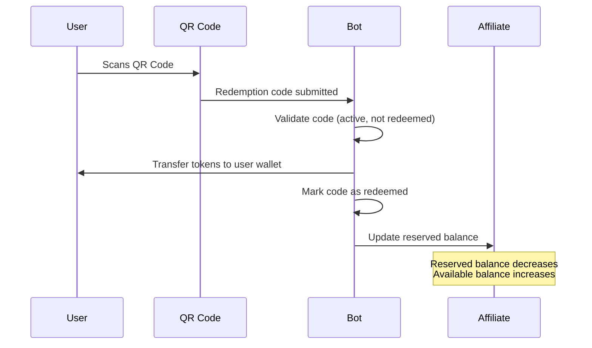

## Overview

Affiliates are users who distribute token allocations to the community through events and QR code redemptions. The affiliate system operates independently from the workflow system, providing a separate mechanism for token distribution.

## Becoming an Affiliate

<Steps>
  <Step title="Submit Request">
    Request affiliate status via `/settings` with required information
  </Step>
  
  <Step title="Admin Approval">
    Wait for admin approval and weekly allocation assignment
  </Step>
  
  <Step title="Access Dashboard">
    Once approved, access the affiliate dashboard at `/affiliates`
  </Step>
  
  <Step title="Create Events">
    Begin creating events and managing token distributions
  </Step>
</Steps>

<Info>
  Affiliates receive a **weekly allocation** configured by admins. This allocation refreshes every Monday at midnight Pacific Time.
</Info>

## Weekly Allocation System

From `/home/daytona/workspace/source/backend/handlers/affiliate_scheduler.go:54-88`

### How Allocations Work

<CardGroup cols={2}>
  <Card title="Weekly Budget" icon="calendar-week">
    Each affiliate is assigned a `weekly_allocation` amount (in token smallest units) by admins. This represents their total distribution capacity per week.
  </Card>

  <Card title="Available Balance" icon="wallet">
    The affiliate's current available balance is:
    ```
    available = weekly_allocation - reserved_in_events
    ```
    Reserved balance includes active events and unredeemed codes.
  </Card>

  <Card title="Refresh Schedule" icon="arrows-rotate">
    Every Monday at midnight (Pacific Time), the system:
    - Recomputes all affiliate balances
    - Resets allocation to `weekly_allocation`
    - Subtracts currently reserved amounts
  </Card>

  <Card title="Carry-Over" icon="circle-info">
    Unused allocation does **not** carry over week-to-week. The weekly allocation is a spending limit, not an accumulating balance.
  </Card>
</CardGroup>

### Balance Calculation

The `AffiliateScheduler` computes balances:

```go
// From affiliate_scheduler.go:54-88
reserved := bot.AllocatedBalanceByOwner(affiliate.UserId)
weekly_balance := affiliate.WeeklyAllocation - reserved
```

- **AllocatedBalanceByOwner**: Sum of all active event values and unredeemed codes
- **weekly_balance**: Current available amount for new events

<Note>
  Creating an event immediately reserves its value from your weekly balance. The reservation lasts until the event expires or all codes are redeemed.
</Note>

## Affiliate Events

Events are time-limited token distribution campaigns with QR codes for redemption.

### Event Structure

```typescript
interface AffiliateEvent {
  id: string
  owner: string              // Affiliate user ID
  name: string               // Event name
  value: number              // Total token value allocated to event
  expiration: number         // Unix timestamp when event expires
  created_at: number         // Unix timestamp
  redemption_codes: RedemptionCode[]
}

interface RedemptionCode {
  id: string
  event_id: string
  code: string               // QR code value
  amount: number             // Token amount for this code
  redeemed: boolean
  redeemed_by?: string | null
  redeemed_at?: number | null
}
```

### Creating Events

<Steps>
  <Step title="Name Your Event">
    Provide a descriptive name (e.g., "Community Cleanup Day")
  </Step>
  
  <Step title="Set Total Value">
    Allocate tokens from your weekly balance to this event
  </Step>
  
  <Step title="Generate Codes">
    Create one or more redemption codes with individual amounts that sum to the total value
  </Step>
  
  <Step title="Set Expiration">
    Choose when the event ends and unredeemed tokens are refunded
  </Step>
</Steps>

### Event Expiration

From `/home/daytona/workspace/source/backend/handlers/affiliate_scheduler.go:90-180`

<AccordionGroup>
  <Accordion title="Expiration Scheduling">
    When an event is created, the `AffiliateScheduler` schedules a timer:
    ```go
    func (s *AffiliateScheduler) ScheduleEventExpiration(
      eventId string,
      owner string,
      expiration uint64,
    )
    ```
    The timer fires at the exact expiration timestamp.
  </Accordion>

  <Accordion title="Expiration Processing">
    When an event expires:
    1. Calculate unredeemed value: `total_value - redeemed_value`
    2. Refund unredeemed value to affiliate's weekly balance
    3. Mark event as expired
    4. Remove from active event list
  </Accordion>

  <Accordion title="Partial Redemption">
    If some codes are redeemed before expiration:
    - Redeemed amounts are **not** refunded
    - Only unredeemed code values return to affiliate balance
    - Event still expires at scheduled time
  </Accordion>

  <Accordion title="Full Redemption">
    If all codes are redeemed before expiration:
    - Event remains active until expiration time
    - No refund occurs (all value was distributed)
    - Event expires normally, removing it from active list
  </Accordion>
</AccordionGroup>

### Event Refund Example

Scenario:
- Event created with 1000 tokens
- 3 redemption codes: 500, 300, 200
- Expiration: 48 hours

**After 24 hours:**
- Code 1 (500 tokens) redeemed ✓
- Code 2 (300 tokens) unredeemed
- Code 3 (200 tokens) unredeemed

**At expiration (48 hours):**
- Unredeemed value: 300 + 200 = 500 tokens
- Refund 500 tokens to affiliate's weekly balance
- Affiliate can now create new events with refunded amount

## QR Code Redemption Flow



### Redemption Process

1. **User Scans QR Code**: Mobile device reads QR code containing redemption code ID
2. **Code Validation**: System checks:
   - Code exists
   - Event is active (not expired)
   - Code has not been redeemed
3. **Token Transfer**: Tokens are sent to user's wallet
4. **Mark Redeemed**: Code is marked with `redeemed: true`, `redeemed_by: user_id`, `redeemed_at: timestamp`
5. **Balance Update**: Affiliate's reserved balance decreases, available balance increases

<Warning>
  Redemption codes are **single-use**. Once redeemed, they cannot be used again. Generate multiple codes for multiple redemptions.
</Warning>

## Affiliate Scheduler

The `AffiliateScheduler` is a background service that manages:

<CardGroup cols={2}>
  <Card title="Weekly Recomputation" icon="calendar-week">
    Runs every Monday at midnight PT to refresh all affiliate weekly balances based on `weekly_allocation` minus reserved amounts.
  </Card>

  <Card title="Event Expiration" icon="clock">
    Maintains timers for each active event. When an event expires, refunds unredeemed value to affiliate balance.
  </Card>

  <Card title="Startup Recovery" icon="rotate">
    On service startup, loads all active events and reschedules expiration timers to handle service restarts gracefully.
  </Card>

  <Card title="Balance Tracking" icon="coins">
    Continuously tracks reserved vs available balances for each affiliate, ensuring accurate allocation enforcement.
  </Card>
</CardGroup>

### Scheduler Implementation

From `/home/daytona/workspace/source/backend/handlers/affiliate_scheduler.go:14-200`

```go
type AffiliateScheduler struct {
  appDb  *db.AppDB
  botDb  *db.BotDB
  logger *logger.LogCloser
  loc    *time.Location  // Pacific Time
  
  mu     sync.Mutex
  timers map[string]*time.Timer  // Event ID -> Timer
}
```

Key methods:
- `Start(ctx)`: Initializes weekly loop and loads existing events
- `RecomputeWeeklyBalances(ctx)`: Recalculates all affiliate balances
- `ScheduleEventExpiration(...)`: Schedules expiration for a single event
- `handleEventExpiration(...)`: Processes expired event and refunds

### Weekly Loop

```go
func (s *AffiliateScheduler) startWeeklyLoop(ctx context.Context) {
  for {
    next := s.nextMondayMidnight(time.Now())
    wait := time.Until(next)
    
    timer := time.NewTimer(wait)
    select {
    case <-ctx.Done():
      return
    case <-timer.C:
      s.RecomputeWeeklyBalances(context.Background())
    }
  }
}
```

The loop:
1. Calculates next Monday midnight
2. Sleeps until that time
3. Recomputes all balances
4. Repeats

<Info>
  The scheduler uses **Pacific Time** (`America/Los_Angeles`) for weekly resets. This ensures consistent reset timing regardless of server timezone.
</Info>

## Affiliate Dashboard

Affiliates manage their events at `/affiliates`:

### Dashboard Features

<Tabs>
  <Tab title="Balance Overview">
    - Current weekly allocation
    - Available balance
    - Reserved balance
    - Next refresh date (Monday midnight)
  </Tab>
  
  <Tab title="Event Management">
    - List of active events
    - Event details (name, value, expiration)
    - Redemption code status
    - Create new events
    - View event history
  </Tab>
  
  <Tab title="Code Generation">
    - Generate single or multiple codes
    - Set individual code amounts
    - Download QR codes for printing
    - Copy code IDs for digital distribution
  </Tab>
  
  <Tab title="Analytics">
    - Total redeemed vs unredeemed
    - Redemption rate per event
    - Top redeeming users
    - Distribution trends over time
  </Tab>
</Tabs>

## Best Practices for Affiliates

<AccordionGroup>
  <Accordion title="Event Planning">
    Plan events to align with your weekly allocation:
    - Don't allocate your entire weekly balance to one event
    - Leave buffer for opportunistic distributions
    - Consider event duration vs week boundary
    - Events expiring Monday morning won't refund until after reset
  </Accordion>

  <Accordion title="Code Distribution">
    - Generate enough codes for expected attendance
    - Use smaller denominations for broader distribution
    - Test QR codes before event to ensure readability
    - Keep backup codes in case of technical issues
  </Accordion>

  <Accordion title="Expiration Timing">
    - Set expiration 2-4 hours after event ends (buffer for late redemptions)
    - Avoid expirations spanning the weekly reset (Monday midnight)
    - Shorter expirations free up balance sooner for new events
  </Accordion>

  <Accordion title="Record Keeping">
    - Document event purpose and outcomes
    - Track redemption rates to improve future events
    - Note which code denominations are most popular
    - Share successful event formats with other affiliates
  </Accordion>
</AccordionGroup>

## Affiliate System Architecture

### Database Tables

The affiliate system spans two databases:

**app database:**
- `affiliates` — User affiliate status and weekly allocations
- `affiliate_weekly_balances` — Current available balances

**bot database:**
- `events` — Affiliate events
- `redemption_codes` — QR codes and redemption status
- `faucet_events` — Token distribution ledger

### Integration Points

<CardGroup cols={2}>
  <Card title="Faucet Service" icon="faucet-drip">
    The affiliate system interacts with the faucet (token distribution) service:
    - Event creation reserves faucet balance
    - Code redemption triggers faucet transfer
    - Expiration refunds reserved balance
  </Card>

  <Card title="Bot Service" icon="robot">
    The `BotService` handles:
    - QR code generation
    - Redemption validation
    - Token transfers via smart contracts
    - Event history tracking
  </Card>
</CardGroup>

## See Also

<CardGroup cols={2}>
  <Card title="Roles" icon="users" href="/concepts/roles">
    Learn about the affiliate role and other platform roles
  </Card>
  <Card title="Workflows" icon="diagram-project" href="/concepts/workflows">
    Understand the workflow system (separate from affiliates)
  </Card>
  <Card title="Voting" icon="check-to-slot" href="/concepts/voting">
    How governance voting works
  </Card>
</CardGroup>