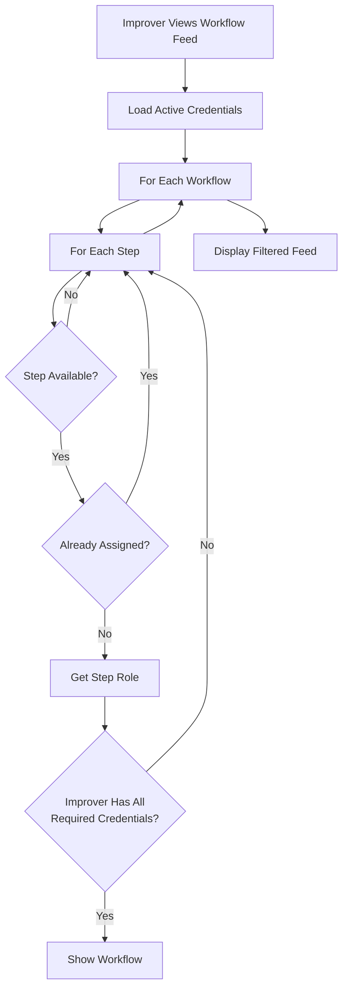

## Overview

Credentials are qualifications granted to improvers that determine which workflow steps they can claim and complete. The credential system ensures that only qualified individuals perform specialized tasks.

## How Credentials Work

<Steps>
  <Step title="Credential Grant">
    An issuer grants a credential to an improver (e.g., `dpw_certified`)
  </Step>
  
  <Step title="Workflow Role Requirements">
    A proposer creates a workflow with roles that require specific credentials
  </Step>
  
  <Step title="Access Control">
    Only improvers holding all required credentials can claim steps assigned to that role
  </Step>
  
  <Step title="Credential Revocation">
    If a credential is revoked, the improver loses access to steps requiring that credential
  </Step>
</Steps>

## Credential Types

Credentials are identified by string values. Current credential types:

<CardGroup cols={2}>
  <Card title="dpw_certified" icon="certificate">
    **Department of Public Works Certification**
    
    Indicates the improver has been certified by the Department of Public Works for specialized tasks like infrastructure maintenance or public works projects.
  </Card>

  <Card title="sfluv_verifier" icon="badge-check">
    **SFLUV Platform Verifier**
    
    Indicates the improver has been verified by SFLUV administrators and can perform platform-specific verification and validation tasks.
  </Card>
</CardGroup>

<Note>
  Additional credential types can be created by admins as the platform grows and new specializations emerge.
</Note>

## Credential Type Definition

```typescript
interface GlobalCredentialType {
  value: string          // Unique identifier (e.g., "dpw_certified")
  label: string          // Human-readable name
  created_at: string     // When the credential type was created
}
```

## Granting Credentials

Issuers can grant credentials to approved improvers:

<CodeGroup>
```typescript API Request
POST /issuer/credentials/issue

{
  "user_id": "did:privy:...",
  "credential_type": "dpw_certified"
}
```

```json Response
{
  "id": "cred_abc123",
  "user_id": "did:privy:...",
  "credential_type": "dpw_certified",
  "issued_by": "did:privy:issuer_xyz",
  "issued_at": 1709582400,
  "revoked_at": null
}
```
</CodeGroup>

### Grant Requirements

<Warning>
  Only users with the **issuer** role can grant credentials. Attempting to grant without issuer privileges returns a 403 Forbidden error.
</Warning>

- Target user must be an approved improver
- Credential type must exist in the system
- Issuer must have active issuer role
- User cannot already hold an active credential of that type

## Revoking Credentials

Issuers can revoke credentials when they are no longer valid:

<CodeGroup>
```typescript API Request
POST /issuer/credentials/revoke

{
  "user_id": "did:privy:...",
  "credential_type": "dpw_certified"
}
```
</CodeGroup>

### Revocation Effects

<AccordionGroup>
  <Accordion title="Immediate Access Loss">
    The improver immediately loses access to any workflow steps requiring the revoked credential. In-progress steps may be affected depending on platform policy.
  </Accordion>

  <Accordion title="Workflow Feed Filtering">
    Workflows requiring the revoked credential are removed from the improver's workflow feed (`/improver` page). The improver can no longer see or claim steps from these workflows.
  </Accordion>

  <Accordion title="Series Claims">
    If an improver has claimed a recurring workflow series, revocation of a required credential releases their claim on future instances. Completed steps remain valid.
  </Accordion>

  <Accordion title="Historical Record">
    Revocation is recorded with a timestamp. The credential entry remains in the database with `revoked_at` populated for audit purposes.
  </Accordion>
</AccordionGroup>

## Workflow Role Requirements

Proposers define roles when creating workflows, specifying required credentials:

```typescript
interface WorkflowRole {
  id: string
  workflow_id: string
  title: string                          // e.g., "Certified Technician"
  required_credentials: CredentialType[] // e.g., ["dpw_certified"]
}
```

### Example: Workflow with Credential Requirements

<CodeGroup>
```typescript Workflow Creation
{
  "title": "Street Repair Project",
  "roles": [
    {
      "client_id": "role_1",
      "title": "Certified Repair Technician",
      "required_credentials": ["dpw_certified"]
    },
    {
      "client_id": "role_2",
      "title": "Quality Verifier",
      "required_credentials": ["sfluv_verifier"]
    }
  ],
  "steps": [
    {
      "title": "Assess damage",
      "role_client_id": "role_1",  // Requires dpw_certified
      "bounty": 5000
    },
    {
      "title": "Verify repair quality",
      "role_client_id": "role_2",  // Requires sfluv_verifier
      "bounty": 3000
    }
  ]
}
```
</CodeGroup>

In this example:
- Step 1 can only be claimed by improvers with `dpw_certified`
- Step 2 can only be claimed by improvers with `sfluv_verifier`
- An improver with both credentials could claim either step
- An improver with neither credential sees no available steps

## Credential Checking Logic

The platform filters workflow visibility based on credentials:



From `/home/daytona/workspace/source/backend/handlers/app_workflow.go:883-991`:

- Load improver's active credentials
- Build credential set for fast lookup
- Iterate through all available workflows
- Check each step's role requirements
- Filter out workflows where improver has no claimable steps

<Info>
  The workflow feed at `/improver` automatically shows only workflows with steps the improver is qualified to claim.
</Info>

## Viewing User Credentials

Issuers can view all credentials for a specific user:

<CodeGroup>
```typescript API Request
GET /issuer/users/:user_id/credentials
```

```json Response
{
  "credentials": [
    {
      "id": "cred_abc123",
      "user_id": "did:privy:...",
      "credential_type": "dpw_certified",
      "issued_by": "did:privy:issuer_xyz",
      "issued_at": 1709582400,
      "revoked_at": null
    },
    {
      "id": "cred_def456",
      "user_id": "did:privy:...",
      "credential_type": "sfluv_verifier",
      "issued_by": "did:privy:issuer_abc",
      "issued_at": 1709668800,
      "revoked_at": 1710273600
    }
  ]
}
```
</CodeGroup>

### Active vs Revoked Credentials

- **Active**: `revoked_at` is `null`
- **Revoked**: `revoked_at` contains a Unix timestamp

Only active credentials are used for access control. Revoked credentials are retained for audit trails.

## Credential-Based Access Summary

<CardGroup cols={2}>
  <Card title="No Credentials" icon="circle-xmark">
    Improvers without any credentials can only claim workflow steps that have **no credential requirements** (empty `required_credentials` array).
  </Card>

  <Card title="Some Credentials" icon="circle-half-stroke">
    Improvers see workflows with steps matching their credential set. Steps requiring credentials they don't hold remain hidden.
  </Card>

  <Card title="Multiple Credentials" icon="circle-check">
    Improvers with multiple credentials have access to a wider range of workflows and can claim steps from multiple specialized roles.
  </Card>

  <Card title="Admin Override" icon="shield-halved">
    Admins can view and access all workflows regardless of credential requirements, but still respect role assignments when configured.
  </Card>
</CardGroup>

## Best Practices

<AccordionGroup>
  <Accordion title="Credential Naming">
    Use clear, descriptive credential type values:
    - ✅ `dpw_certified`, `first_aid_certified`, `forklift_operator`
    - ❌ `cred1`, `type_a`, `qualification`
  </Accordion>

  <Accordion title="Credential Granularity">
    Create credentials at the right level of specificity:
    - Too broad: `certified` (certified in what?)
    - Too narrow: `widget_repair_monday_only` (overly specific)
    - Just right: `widget_repair_certified` (clear scope)
  </Accordion>

  <Accordion title="Documentation">
    Maintain documentation of what each credential represents and the requirements for obtaining it. This ensures consistent application across issuers.
  </Accordion>

  <Accordion title="Audit Trail">
    Use the issuer interface at `/issuer` to regularly review:
    - Who has which credentials
    - When credentials were granted
    - When credentials were revoked
    - Which workflows require specific credentials
  </Accordion>
</AccordionGroup>

## Credential Database Schema

While implementation details are abstracted, understanding the conceptual schema helps:

```typescript
interface UserCredential {
  id: string              // Unique credential instance ID
  user_id: string         // Improver DID
  credential_type: string // Type reference (e.g., "dpw_certified")
  issued_by: string       // Issuer DID
  issued_at: number       // Unix timestamp
  revoked_at: number | null // Unix timestamp or null
  revoked_by: string | null // Issuer DID or null
}
```

<Info>
  The system tracks both **who issued** and **who revoked** credentials for full accountability.
</Info>

## See Also

<CardGroup cols={2}>
  <Card title="Roles" icon="users" href="/concepts/roles">
    Learn about the issuer role and other platform roles
  </Card>
  <Card title="Workflows" icon="diagram-project" href="/concepts/workflows">
    How workflows define role requirements
  </Card>
  <Card title="Voting" icon="check-to-slot" href="/concepts/voting">
    Workflow approval process
  </Card>
</CardGroup>