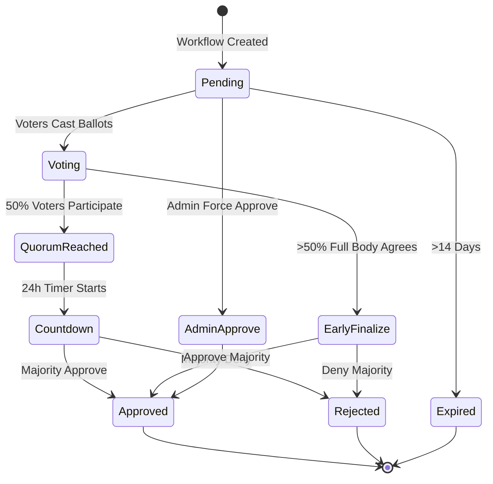

## Overview

All workflows must pass through a voting process before they can be executed. Voters review pending workflow proposals and decide whether to approve or deny them based on merit, feasibility, and budget considerations.

## Voting Lifecycle



## Voter Eligibility

Not all users can vote. Voter eligibility rules:

<CardGroup cols={2}>
  <Card title="Must Have Voter Role" icon="check">
    Only users with the `isVoter` flag set by admins can participate in voting.
  </Card>

  <Card title="Cannot Vote Own Proposals" icon="xmark">
    Voters who are also the proposer of a workflow are excluded from voting on that specific workflow to prevent conflicts of interest.
  </Card>
</CardGroup>

### Eligible Voter Count

For each workflow, the system calculates:

```typescript
interface WorkflowVotes {
  total_voters: number      // All voters minus proposer
  votes_cast: number        // How many have voted
  approve: number           // Approve vote count
  deny: number              // Deny vote count
  quorum_reached: boolean   // votes_cast >= 50% of total_voters
  quorum_threshold: number  // Calculated as total_voters / 2
}
```

From `/home/daytona/workspace/source/frontend/types/workflow.ts:85-97`

## Quorum Requirements

Quorum is the minimum participation threshold for a vote to proceed:

<Steps>
  <Step title="Calculate Quorum">
    Quorum = 50% of `total_voters` (eligible voters for this workflow)
  </Step>
  
  <Step title="Track Participation">
    As voters cast ballots, `votes_cast` increments
  </Step>
  
  <Step title="Reach Quorum">
    When `votes_cast >= quorum_threshold`, quorum is reached
  </Step>
  
  <Step title="Start Countdown">
    A 24-hour countdown timer starts at `quorum_reached_at` timestamp
  </Step>
</Steps>

<Info>
  Quorum encourages broad participation. Workflows cannot be finalized without sufficient voter engagement.
</Info>

### Quorum Example

Scenario: 10 eligible voters

- **Quorum threshold**: 5 voters (50%)
- **Votes cast**: 3 approve, 1 deny = 4 total
- **Quorum reached?** No (4 < 5)
- **Action**: Workflow remains in `pending`, awaiting more votes

After one more vote:
- **Votes cast**: 3 approve, 2 deny = 5 total
- **Quorum reached?** Yes (5 >= 5)
- **Action**: 24-hour countdown begins at `quorum_reached_at`

## 24-Hour Countdown

Once quorum is reached, a countdown timer provides a window for additional voting:

<AccordionGroup>
  <Accordion title="Countdown Purpose">
    The 24-hour countdown allows voters who haven't participated yet to review the workflow and cast their votes. This prevents hasty decisions and ensures all interested voters have an opportunity to participate.
  </Accordion>

  <Accordion title="Countdown Timestamps">
    - `quorum_reached_at`: Unix timestamp when quorum was achieved
    - `finalize_at`: `quorum_reached_at + 86400` (24 hours later)
    - `finalized_at`: Unix timestamp when vote was actually finalized
  </Accordion>

  <Accordion title="During Countdown">
    - Workflow status remains `pending`
    - Additional voters can still cast ballots
    - Vote tallies update in real-time
    - Early finalization may occur if conditions are met
  </Accordion>

  <Accordion title="After Countdown">
    - Workflow is evaluated on next vote endpoint call (lazy finalization)
    - Status changes to `approved` or `rejected` based on majority
    - `finalized_at` timestamp is recorded
    - Email notifications are sent to proposer and relevant parties
  </Accordion>
</AccordionGroup>

<Note>
  Vote finalization is currently **lazy** — it happens when the vote endpoint is called after the countdown expires. Scheduled background finalization is planned for a future update.
</Note>

## Early Finalization

Votes can be finalized before the 24-hour countdown if a supermajority is reached:

### Early Finalization Conditions

Early finalization occurs when:

```typescript
// More than 50% of the FULL voter body (not just quorum) agrees
if (approve_votes > total_voters / 2) {
  // Early approve
} else if (deny_votes > total_voters / 2) {
  // Early deny
}
```

### Early Finalization Example

Scenario: 10 eligible voters

- **Quorum threshold**: 5 voters
- **Early finalization threshold**: 6 voters with same decision (>50% of 10)

**Case 1: Early Approve**
- Votes cast: 6 approve, 0 deny
- Result: **Workflow approved immediately** (6 > 5, unanimous so far)
- Countdown is bypassed

**Case 2: Countdown Required**
- Votes cast: 4 approve, 2 deny = 6 total
- Result: Quorum reached, but no supermajority
- 24-hour countdown proceeds

<Info>
  Early finalization accelerates uncontroversial workflows while ensuring contentious proposals get full deliberation.
</Info>

## Vote Outcomes

### Approved

A workflow is approved when:

1. Quorum was reached
2. 24-hour countdown elapsed (or early finalization threshold met)
3. `approve_votes > deny_votes` (simple majority)

Approved workflows:
- Status changes to `approved`
- `vote_decision` set to `"approve"`
- Workflow proceeds to execution phase
- Proposer receives approval notification email

### Rejected

A workflow is rejected when:

1. Quorum was reached
2. 24-hour countdown elapsed (or early finalization threshold met)
3. `deny_votes >= approve_votes` (ties go to rejection)

Rejected workflows:
- Status changes to `rejected`
- `vote_decision` set to `"deny"`
- Workflow cannot be executed
- Proposer receives rejection notification email

### Expired

A workflow expires when:

- Status is `pending` for more than 14 days
- Quorum was never reached or vote never finalized

Expired workflows:
- Status changes to `expired`
- No further voting allowed
- Proposer can create a new workflow proposal if desired

<Warning>
  Expired workflows indicate insufficient voter engagement. Consider revising the proposal or addressing concerns before resubmitting.
</Warning>

## Admin Force Approve

Admins can bypass the voting process entirely:

<CodeGroup>
```typescript API Request
POST /admin/workflows/:workflow_id/force-approve
```
</CodeGroup>

From `/home/daytona/workspace/source/backend/handlers/app_workflow.go:2720-2780`

### Force Approve Behavior

<AccordionGroup>
  <Accordion title="When to Use">
    - Emergency workflows requiring immediate execution
    - Workflows with unanimous informal agreement
    - Administrative or maintenance workflows
    - Situations where the voting process would cause unacceptable delay
  </Accordion>

  <Accordion title="Requirements">
    - User must have admin role
    - Workflow must be in `pending` status
    - Faucet must have sufficient balance (same check as normal approval)
  </Accordion>

  <Accordion title="Effects">
    - Status immediately changes to `approved`
    - `vote_decision` set to `"admin_approve"` (distinct from normal `"approve"`)
    - `vote_finalized_by_user_id` records which admin approved
    - Approval email sent to proposer
  </Accordion>

  <Accordion title="Audit Trail">
    The `"admin_approve"` decision value in the database distinguishes admin-approved workflows from voter-approved workflows for transparency and accountability.
  </Accordion>
</AccordionGroup>

<Warning>
  Admin force approval should be used judiciously. It bypasses the community governance process.
</Warning>

## Budget Constraints

Vote approval (whether by voters or admin) is blocked if the faucet cannot fund the workflow:

### Faucet Balance Check

From `/home/daytona/workspace/source/backend/handlers/app_workflow.go:3456-3471`:

```go
// Approval blocked if unallocated balance < one week of workflow requirement
unallocatedTokens >= workflow.WeeklyBountyRequirement
```

<CardGroup cols={2}>
  <Card title="Sufficient Balance" icon="check">
    Workflow approval can proceed. Budget is allocated to the workflow upon approval.
  </Card>

  <Card title="Insufficient Balance" icon="xmark">
    Approval is blocked even if vote passes. Status remains `pending`. Email notification sent about funding shortfall.
  </Card>
</CardGroup>

<Info>
  This check ensures approved workflows can actually be paid out, preventing approval of unfunded commitments.
</Info>

## Casting a Vote

Voters cast ballots through the voter interface:

<CodeGroup>
```typescript API Request
POST /voter/workflows/:workflow_id/vote

{
  "decision": "approve",  // or "deny"
  "comment": "Optional explanation for vote"
}
```

```json Response
{
  "id": "wf_abc123",
  "status": "pending",
  "votes": {
    "approve": 4,
    "deny": 1,
    "votes_cast": 5,
    "total_voters": 8,
    "quorum_reached": true,
    "quorum_threshold": 4,
    "quorum_reached_at": 1709582400,
    "finalize_at": 1709668800,
    "decision": null,
    "my_decision": "approve"
  }
}
```
</CodeGroup>

From `/home/daytona/workspace/source/backend/handlers/app_workflow.go:2640-2718`

### Vote Properties

- **decision**: `"approve"` or `"deny"` (required)
- **comment**: Optional text explanation for the vote
- **my_decision**: Returned in response, shows how current user voted
- **Immutable**: Once cast, votes cannot be changed

<Warning>
  Votes are permanent and cannot be edited. Review the workflow carefully before submitting your decision.
</Warning>

## Deletion Proposals

Workflows can also be proposed for deletion through a similar voting process:

### Deletion Vote Characteristics

- Same quorum requirements (50% participation)
- Same 24-hour countdown after quorum
- Same early finalization rules
- Admin can force approve deletions
- Deletion targets can be a single workflow or an entire series

From `/home/daytona/workspace/source/backend/handlers/app_workflow.go:2959-2977`

<Note>
  Deletion proposals are particularly important for stopping problematic recurring workflows before they create additional instances.
</Note>

## Viewing Pending Votes

Voters access pending workflows at `/voter`:

<CodeGroup>
```typescript API Request
GET /voter/workflows
```

```json Response
[
  {
    "id": "wf_abc123",
    "title": "Street Cleaning Initiative",
    "proposer_id": "did:privy:proposer_xyz",
    "status": "pending",
    "total_bounty": 50000,
    "votes": {
      "approve": 2,
      "deny": 1,
      "votes_cast": 3,
      "total_voters": 8,
      "quorum_reached": false,
      "quorum_threshold": 4,
      "my_decision": null
    }
  }
]
```
</CodeGroup>

The response includes:
- All workflows in `pending` status
- Current vote tallies
- Quorum progress
- User's own vote if already cast

## Vote State Evaluation

The system evaluates vote state on every relevant API call:

1. **GetVoterWorkflows**: Checks all pending workflows, finalizes any past countdown
2. **VoteWorkflow**: Evaluates immediately after vote is cast
3. **GetProposerWorkflow**: Proposers see updated vote status

This lazy evaluation pattern means votes are finalized "just in time" rather than on a strict schedule.

<Info>
  Future enhancement: Background job to finalize votes at exact countdown expiration rather than waiting for next API call.
</Info>

## Voting Best Practices

<AccordionGroup>
  <Accordion title="Review Thoroughly">
    - Read the full workflow description
    - Review all steps and bounties
    - Check credential requirements
    - Consider budget impact
    - Evaluate feasibility
  </Accordion>

  <Accordion title="Use Comments">
    Provide context for your vote, especially if denying:
    - "Budget too high for current allocation"
    - "Needs more specific deliverables in step 2"
    - "Excellent proposal, addresses community need"
  </Accordion>

  <Accordion title="Vote Promptly">
    Workflows stuck in voting delay community projects. Review pending workflows regularly and vote in a timely manner.
  </Accordion>

  <Accordion title="Consider Recurrence">
    Recurring workflows have ongoing budget impact. A weekly workflow consumes 52x its bounty annually.
  </Accordion>
</AccordionGroup>

## See Also

<CardGroup cols={2}>
  <Card title="Workflows" icon="diagram-project" href="/concepts/workflows">
    Understand workflow structure and lifecycle
  </Card>
  <Card title="Roles" icon="users" href="/concepts/roles">
    Learn about the voter role
  </Card>
  <Card title="Credentials" icon="certificate" href="/concepts/credentials">
    How credentials affect workflow access
  </Card>
</CardGroup>