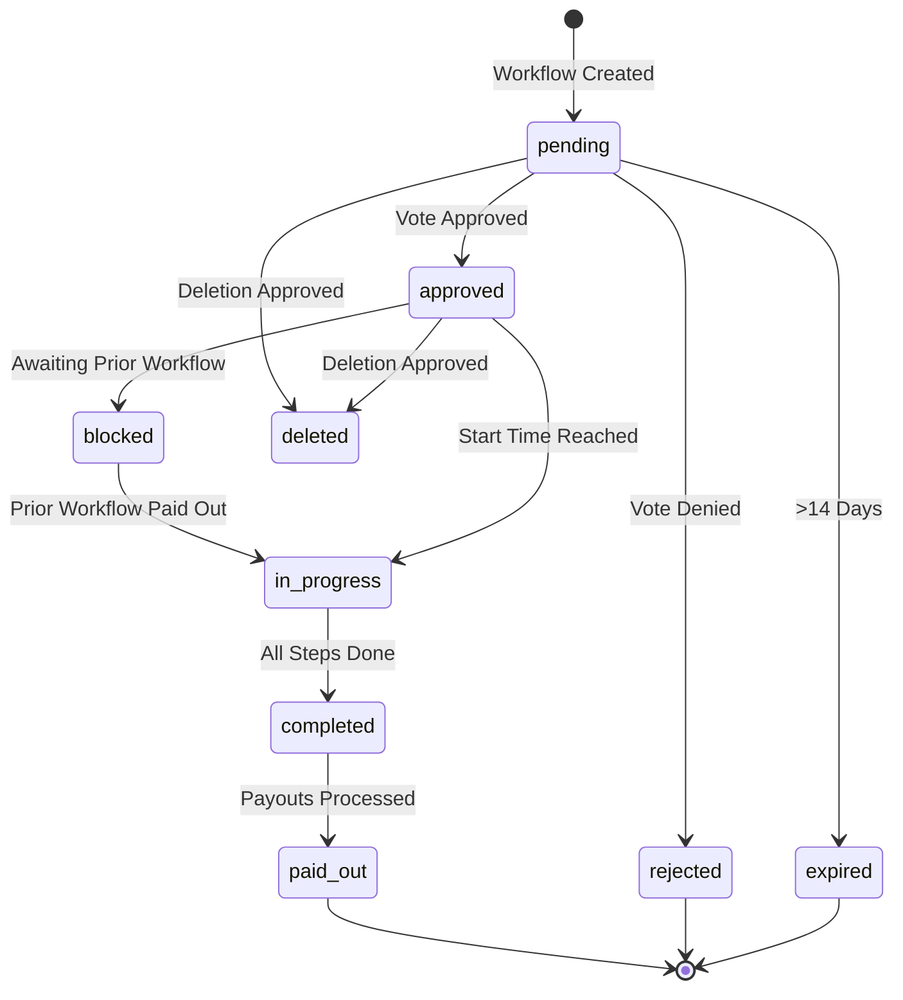
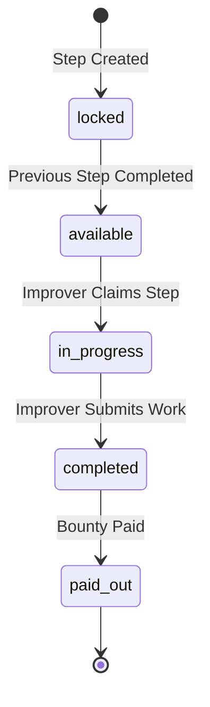

## Overview

Workflows are the core mechanism in SFLUV for coordinating community projects. They define structured tasks that need to be completed by improvers, with each workflow going through a governance voting process before execution.

## Workflow Lifecycle

A workflow progresses through distinct stages from creation to payout:



### Status Definitions

<AccordionGroup>
  <Accordion title="pending">
    The workflow is under review and awaiting voter approval. Workflows remain in `pending` status until the voting process concludes or 14 days elapse.
  </Accordion>

  <Accordion title="approved">
    The workflow has passed the voting process and is scheduled to start at the specified `start_at` time.
  </Accordion>

  <Accordion title="rejected">
    The workflow was denied during the voting process. No further action will be taken.
  </Accordion>

  <Accordion title="expired">
    The workflow remained in `pending` status for more than 14 days without reaching a voting decision. Expired workflows are automatically closed.
  </Accordion>

  <Accordion title="blocked">
    A recurring workflow instance that cannot start because a previous workflow in the same series has not yet reached `paid_out` status. The `is_start_blocked` flag is set to `true` and `blocked_by_workflow_id` references the blocking workflow.
  </Accordion>

  <Accordion title="in_progress">
    The workflow has started and improvers are actively working on completing steps.
  </Accordion>

  <Accordion title="completed">
    All workflow steps have been completed. The workflow is awaiting payout processing.
  </Accordion>

  <Accordion title="paid_out">
    All bounties have been successfully paid out to improvers. This is the final status for a successfully completed workflow.
  </Accordion>

  <Accordion title="deleted">
    The workflow was removed through a deletion proposal and vote. Deleted workflows are no longer active.
  </Accordion>
</AccordionGroup>

## Workflow Steps

Each workflow consists of sequential steps that must be completed in order. Steps unlock progressively as the previous step is completed.

### Step Lifecycle



### Step Properties

Each step includes:

- **Title and Description**: What needs to be done
- **Bounty**: Amount paid to the improver upon completion (in wrapped HONEY tokens)
- **Role Assignment**: Which improver role can claim and complete the step
- **Work Items**: Individual tasks within the step (photos, written responses, dropdown selections)
- **Step Order**: Sequential position in the workflow
- **Allow Step Not Possible**: Option for improver to report a step cannot be completed

### Work Items

Steps contain work items that define specific deliverables:

<CardGroup cols={2}>
  <Card title="Photo Requirements" icon="camera">
    - Required vs optional photos
    - Camera capture only mode
    - Aspect ratio constraints (vertical, square, horizontal)
    - Minimum photo count
  </Card>

  <Card title="Text Responses" icon="pen">
    - Written response fields
    - Dropdown selections with predefined options
    - Conditional fields based on dropdown selection
    - Email notifications on specific responses
  </Card>
</CardGroup>

## Recurring Workflows (Series)

Workflows can be configured to recur on a schedule, creating a series of related workflow instances.

### Recurrence Types

<CodeGroup>
```typescript Recurrence Options
type WorkflowRecurrence = "one_time" | "daily" | "weekly" | "monthly"
```
</CodeGroup>

- **one_time**: Single execution, no recurrence
- **daily**: Creates a new instance daily
- **weekly**: Creates a new instance weekly
- **monthly**: Creates a new instance monthly

### Series Behavior

Workflows in a series share a common `series_id`. Key characteristics:

<Note>
  Recurring workflow instances are **blocked** until the previous instance reaches `paid_out` status. This ensures sequential execution and prevents overlapping work.
</Note>

- Only one workflow instance in a series can be `in_progress` at a time
- The `is_start_blocked` flag indicates if a workflow is waiting for a prior instance
- Improvers can claim entire series for consistent assignment across recurrences
- Absence periods can be set to skip specific recurring instances

### Budget Tracking

Recurring workflows have special budget considerations:

- **weekly_bounty_requirement**: Weekly cost calculated based on recurrence frequency
- **budget_weekly_deducted**: Running total of weekly budget consumed
- **budget_one_time_deducted**: One-time costs (applied only to first instance)

<Warning>
  Workflow approval is blocked if the unallocated faucet balance is less than one week of the workflow's requirement.
</Warning>

## Workflow Templates

Templates allow proposers and admins to save workflow configurations for reuse:

- **User Templates**: Created by proposers, visible only to them
- **Default Templates**: Created by admins, visible to all proposers
- Templates include roles, steps, work items, and supervisor configuration
- Series ID can be carried over to maintain recurring workflow relationships

## Workflow Roles

Workflows define custom roles that specify:

```typescript
interface WorkflowRole {
  id: string
  workflow_id: string
  title: string
  required_credentials: CredentialType[]
}
```

- **Role Title**: Descriptive name for the role within the workflow
- **Credential Requirements**: Which credentials an improver must hold to claim steps assigned to this role

Improvers can only claim and work on steps if they hold all required credentials for the step's role.

## Supervisor Role

Workflows can optionally include a supervisor:

- Supervisors receive a separate bounty upon workflow completion
- Supervisors have visibility into all step submissions and data
- Supervisors can export workflow data and photos for oversight
- The supervisor role is requested and approved separately from other roles

<Info>
  Supervisors do not perform workflow steps but provide oversight and validation of completed work.
</Info>

## See Also

<CardGroup cols={2}>
  <Card title="Voting" icon="check-to-slot" href="/concepts/voting">
    Learn about workflow approval voting
  </Card>
  <Card title="Roles" icon="users" href="/concepts/roles">
    Understand all user roles in SFLUV
  </Card>
  <Card title="Credentials" icon="certificate" href="/concepts/credentials">
    Explore the credential system
  </Card>
  <Card title="Affiliates" icon="handshake" href="/concepts/affiliates">
    Affiliate event system
  </Card>
</CardGroup>