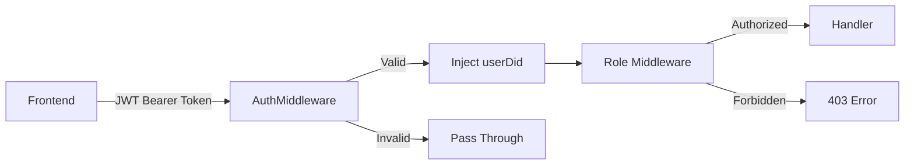

## Overview

SFLUV uses middleware to:

1. **Authenticate requests** via Privy JWT tokens
2. **Authorize users** based on roles (admin, proposer, improver, voter, issuer, affiliate)
3. **Inject user context** into request handlers

**Location**: `backend/utils/middleware/` and `backend/router/router.go`

---

## Authentication Flow



1. Frontend calls API with `Access-Token` header (Privy JWT)
2. `AuthMiddleware` validates JWT signature and claims
3. If valid, extracts `userDid` (Privy DID) and injects into request context
4. Role middleware checks user permissions
5. Handler executes with authenticated context

---

## AuthMiddleware

**Location**: `backend/utils/middleware/auth.go:14-41`

### Implementation

```go
func AuthMiddleware(next http.Handler) http.Handler {
    return http.HandlerFunc(func(w http.ResponseWriter, r *http.Request) {
        // 1. Extract JWT from header
        accessToken := r.Header.Get("Access-Token")
        
        // 2. Parse and validate JWT
        token, err := jwt.ParseWithClaims(accessToken, &jwt.MapClaims{}, keyFunc)
        if err != nil {
            // Invalid token - continue without authentication
            next.ServeHTTP(w, r)
            return
        }
        
        // 3. Validate claims (audience, issuer, expiration)
        err = Valid(token.Claims)
        if err != nil {
            next.ServeHTTP(w, r)
            return
        }
        
        // 4. Extract user DID from subject claim
        userDid, err := token.Claims.GetSubject()
        if err != nil {
            next.ServeHTTP(w, r)
            return
        }
        
        // 5. Inject userDid into request context
        ctx := context.WithValue(r.Context(), "userDid", userDid)
        r = r.WithContext(ctx)
        
        next.ServeHTTP(w, r)
    })
}
```

<Note>
`AuthMiddleware` **does not block** unauthenticated requests. It only injects `userDid` if the token is valid. Route-specific middleware (e.g., `withAuth`) enforces authentication.
</Note>

### JWT Validation

`backend/utils/middleware/auth.go:43-71`

```go
func Valid(c jwt.Claims) error {
    // 1. Verify audience is Privy App ID
    appId := os.Getenv("PRIVY_APP_ID")
    aud, err := c.GetAudience()
    if err != nil || aud[0] != appId {
        return errors.New("aud claim must be your Privy App ID")
    }
    
    // 2. Verify issuer is Privy
    iss, err := c.GetIssuer()
    if err != nil || iss != "privy.io" {
        return errors.New("iss claim must be 'privy.io'")
    }
    
    // 3. Verify token not expired
    exp, err := c.GetExpirationTime()
    if err != nil || exp.Before(time.Now()) {
        return errors.New("token is expired")
    }
    
    return nil
}
```

### Key Function (ES256 Signature)

```go
func keyFunc(token *jwt.Token) (interface{}, error) {
    // Privy uses ES256 (ECDSA) signing
    if token.Method.Alg() != "ES256" {
        return nil, fmt.Errorf("unexpected JWT signing method=%v", token.Header["alg"])
    }
    
    // Parse ES256 public key from env
    verificationKey := os.Getenv("PRIVY_VKEY")
    return jwt.ParseECPublicKeyFromPEM([]byte(verificationKey))
}
```

<Tip>
Get your `PRIVY_VKEY` from the [Privy Dashboard](https://dashboard.privy.io) under Settings → API Keys.
</Tip>

---

## Role Middleware

**Location**: `backend/router/router.go:206-386`

Role middleware wraps handlers to enforce authorization.

### withAuth (Basic Authentication)

`backend/router/router.go:206-216`

Requires any authenticated user:

```go
func withAuth(handlerFunc http.HandlerFunc) http.HandlerFunc {
    return func(w http.ResponseWriter, r *http.Request) {
        // Check if userDid exists in context
        _, ok := r.Context().Value("userDid").(string)
        if !ok {
            w.WriteHeader(http.StatusForbidden)
            return
        }
        
        handlerFunc(w, r)
    }
}
```

**Usage**:

```go
r.Get("/users", withAuth(s.GetUserAuthed))
r.Post("/wallets", withAuth(s.AddWallet))
```

### withAdmin (Admin Only)

`backend/router/router.go:218-248`

Requires admin role OR valid `X-Admin-Key` header:

```go
func withAdmin(handlerFunc http.HandlerFunc, s *handlers.AppService) http.HandlerFunc {
    return func(w http.ResponseWriter, r *http.Request) {
        // 1. Check for X-Admin-Key header (for scripts)
        reqKey := r.Header.Get("X-Admin-Key")
        envKey := os.Getenv("ADMIN_KEY")
        if reqKey == envKey && envKey != "" {
            // Inject default admin user if no JWT present
            if _, ok := r.Context().Value("userDid").(string); !ok {
                adminId := s.GetFirstAdminId(r.Context())
                if adminId != "" {
                    ctx := context.WithValue(r.Context(), "userDid", adminId)
                    r = r.WithContext(ctx)
                }
            }
            handlerFunc(w, r)
            return
        }
        
        // 2. Check if authenticated user is admin
        id, ok := r.Context().Value("userDid").(string)
        if !ok {
            w.WriteHeader(http.StatusForbidden)
            return
        }
        
        isAdmin := s.IsAdmin(r.Context(), id)
        if !isAdmin {
            w.WriteHeader(http.StatusForbidden)
            return
        }
        
        handlerFunc(w, r)
    }
}
```

**Usage**:

```go
r.Get("/admin/users", withAdmin(s.GetUsers, s))
r.Put("/admin/locations", withAdmin(s.UpdateLocationApproval, s))
```

<Tip>
The `X-Admin-Key` header allows scripts to call admin endpoints without JWT authentication.
</Tip>

### withProposer

`backend/router/router.go:273-294`

Requires proposer role (or admin bypass):

```go
func withProposer(handlerFunc http.HandlerFunc, s *handlers.AppService) http.HandlerFunc {
    return func(w http.ResponseWriter, r *http.Request) {
        id, ok := r.Context().Value("userDid").(string)
        if !ok {
            w.WriteHeader(http.StatusForbidden)
            return
        }
        
        // Admin bypass
        if s.IsAdmin(r.Context(), id) {
            handlerFunc(w, r)
            return
        }
        
        // Check proposer role
        isProposer := s.IsProposer(r.Context(), id)
        if !isProposer {
            w.WriteHeader(http.StatusForbidden)
            return
        }
        
        handlerFunc(w, r)
    }
}
```

**Usage**:

```go
r.Post("/proposers/workflows", withProposer(a.CreateWorkflow, a))
r.Get("/proposers/workflows", withProposer(a.GetProposerWorkflows, a))
```

### withImprover

`backend/router/router.go:296-317`

Requires improver role (or admin bypass):

```go
func withImprover(handlerFunc http.HandlerFunc, s *handlers.AppService) http.HandlerFunc {
    return func(w http.ResponseWriter, r *http.Request) {
        id, ok := r.Context().Value("userDid").(string)
        if !ok {
            w.WriteHeader(http.StatusForbidden)
            return
        }
        
        if s.IsAdmin(r.Context(), id) {
            handlerFunc(w, r)
            return
        }
        
        isImprover := s.IsImprover(r.Context(), id)
        if !isImprover {
            w.WriteHeader(http.StatusForbidden)
            return
        }
        
        handlerFunc(w, r)
    }
}
```

**Usage**:

```go
r.Get("/improvers/workflows", withImprover(a.GetImproverWorkflows, a))
r.Post("/improvers/workflows/{id}/steps/{step_id}/claim", withImprover(a.ClaimWorkflowStep, a))
```

### withVoter

`backend/router/router.go:319-340`

Requires voter role (or admin bypass):

```go
func withVoter(handlerFunc http.HandlerFunc, s *handlers.AppService) http.HandlerFunc {
    // Similar pattern to withProposer/withImprover
}
```

**Usage**:

```go
r.Get("/voters/workflows", withVoter(a.GetVoterWorkflows, a))
r.Post("/workflows/{workflow_id}/votes", withVoter(a.VoteWorkflow, a))
```

### withIssuer

`backend/router/router.go:342-363`

Requires issuer role (or admin bypass):

```go
func withIssuer(handlerFunc http.HandlerFunc, s *handlers.AppService) http.HandlerFunc {
    // Similar pattern
}
```

**Usage**:

```go
r.Post("/issuers/credentials", withIssuer(a.IssueCredential, a))
r.Delete("/issuers/credentials", withIssuer(a.RevokeCredential, a))
```

### withAffiliate

`backend/router/router.go:250-271`

Requires affiliate role (or admin bypass):

```go
func withAffiliate(handlerFunc http.HandlerFunc, s *handlers.AppService) http.HandlerFunc {
    // Similar pattern
}
```

**Usage**:

```go
r.Post("/affiliates/events", withAffiliate(s.AffiliateNewEvent, a))
r.Get("/affiliates/balance", withAffiliate(s.AffiliateBalance, a))
```

### withSupervisor

`backend/router/router.go:365-386`

Requires supervisor role (or admin bypass):

```go
func withSupervisor(handlerFunc http.HandlerFunc, s *handlers.AppService) http.HandlerFunc {
    // Similar pattern
}
```

**Usage**:

```go
r.Get("/supervisors/workflows", withSupervisor(a.GetSupervisorWorkflows, a))
r.Post("/supervisors/workflows/export", withSupervisor(a.ExportSupervisorWorkflowData, a))
```

---

## Role Check Functions

Implemented in `handlers/app_admin.go`:

```go
func (a *AppService) IsAdmin(ctx context.Context, userDid string) bool {
    user, err := a.db.GetUserByDid(ctx, userDid)
    if err != nil {
        return false
    }
    return user.IsAdmin
}

func (a *AppService) IsProposer(ctx context.Context, userDid string) bool {
    proposer, err := a.db.GetProposerByUserId(ctx, userDid)
    if err != nil {
        return false
    }
    return proposer.Status == "approved"
}

func (a *AppService) IsImprover(ctx context.Context, userDid string) bool {
    improver, err := a.db.GetImproverByUserId(ctx, userDid)
    if err != nil {
        return false
    }
    return improver.Status == "approved"
}

// Similar for IsVoter, IsIssuer, IsAffiliate, IsSupervisor
```

<Warning>
Role checks query the database on **every request**. Consider caching role data in production.
</Warning>

---

## Admin Bypass Pattern

All role middleware allows admin users to access any endpoint:

```go
if s.IsAdmin(r.Context(), id) {
    handlerFunc(w, r)
    return
}
```

This allows admins to:
- Create workflows as proposers
- Claim steps as improvers
- Vote on workflows
- Issue credentials
- Access all role-specific features

---

## CORS Middleware

`backend/router/router.go:19-27`

```go
r.Use(cors.Handler(cors.Options{
    AllowedOrigins:   []string{"*"},
    AllowedMethods:   []string{"GET", "POST", "PUT", "DELETE", "OPTIONS"},
    AllowedHeaders:   []string{"Accept", "Authorization", "Content-Type", "X-CSRF-Token", "Access-Token", "X-Admin-Key"},
    ExposedHeaders:   []string{"Link"},
    AllowCredentials: false,
    MaxAge:           300,
}))
```

<Note>
`AllowedOrigins: ["*"]` permits all origins. Restrict this in production.
</Note>

---

## Middleware Application

### Global Middleware

Applied to all routes:

```go
func New(s *handlers.BotService, a *handlers.AppService, p *handlers.PonderService) *chi.Mux {
    r := chi.NewRouter()
    
    r.Use(middleware.Logger)        // Log all requests
    r.Use(cors.Handler(...))        // CORS
    r.Use(m.AuthMiddleware)         // JWT validation
    
    // Register routes
    AddBotRoutes(r, s, a)
    AddUserRoutes(r, a)
    // ...
    
    return r
}
```

### Route-Specific Middleware

Applied per endpoint:

```go
func AddWorkflowRoutes(r *chi.Mux, s *handlers.BotService, a *handlers.AppService) {
    // Public (no auth)
    r.Get("/workflows/active", withAuth(a.GetActiveWorkflows))
    
    // Proposer-only
    r.Post("/proposers/workflows", withProposer(a.CreateWorkflow, a))
    
    // Voter-only
    r.Post("/workflows/{workflow_id}/votes", withVoter(a.VoteWorkflow, a))
    
    // Admin-only
    r.Post("/admin/workflows/{workflow_id}/force-approve", withAdmin(a.AdminForceApproveWorkflow, a))
}
```

---

## Testing Middleware

### Mock Authenticated Request

```go
func TestHandlerWithAuth(t *testing.T) {
    req := httptest.NewRequest("GET", "/users", nil)
    
    // Inject authenticated user context
    ctx := context.WithValue(req.Context(), "userDid", "test-user-did")
    req = req.WithContext(ctx)
    
    w := httptest.NewRecorder()
    handler := withAuth(testHandler)
    handler(w, req)
    
    assert.Equal(t, http.StatusOK, w.Code)
}
```

### Test Admin Bypass

```go
func TestAdminBypass(t *testing.T) {
    mockAppService := &MockAppService{
        IsAdminFunc: func(ctx context.Context, userDid string) bool {
            return true
        },
    }
    
    req := httptest.NewRequest("POST", "/proposers/workflows", nil)
    ctx := context.WithValue(req.Context(), "userDid", "admin-user")
    req = req.WithContext(ctx)
    
    w := httptest.NewRecorder()
    handler := withProposer(testHandler, mockAppService)
    handler(w, req)
    
    // Admin can access proposer endpoint
    assert.Equal(t, http.StatusOK, w.Code)
}
```

---

## Security Best Practices

<Warning>
1. **Never trust client-provided role claims** - Always query database for roles
2. **Validate JWT signature** - Use Privy's public key (ES256)
3. **Check token expiration** - Reject expired tokens
4. **Rotate ADMIN_KEY** - Change periodically and never commit to git
5. **Log failed auth attempts** - Monitor for brute force attacks
6. **Rate limit auth endpoints** - Prevent credential stuffing
</Warning>

---

## Next Steps

<CardGroup cols={2}>
  <Card title="Handlers" icon="code" href="/dev/handlers">
    How handlers use authenticated context
  </Card>
  <Card title="Frontend Context" icon="react" href="/dev/context">
    How frontend obtains and sends JWT tokens
  </Card>
</CardGroup>